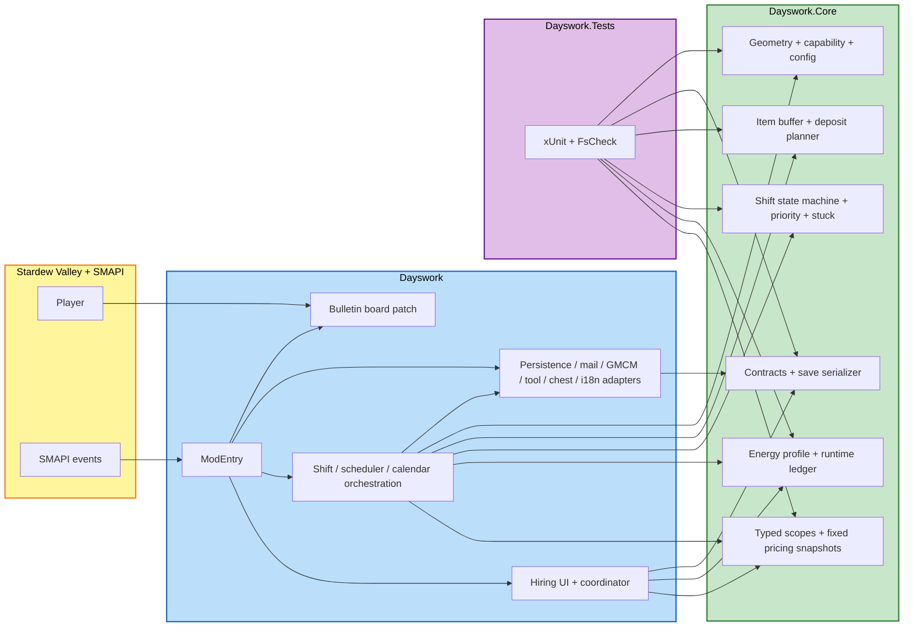

# Application Design — Pricing Model Redesign

This document is the consolidated entry point for the refreshed Application Design stage. It supersedes only the pricing-related seams of the earlier design. The broader project architecture remains the same: pure logic in `Dayswork.Core`, SMAPI integration in `Dayswork`, and tests against the pure layer in `Dayswork.Tests`.

Supporting design artifacts:
- [components.md](components.md)
- [component-methods.md](component-methods.md)
- [services.md](services.md)
- [component-dependency.md](component-dependency.md)
- [design-verification-notes.md](design-verification-notes.md) for non-pricing SMAPI/Stardew verification details that still apply

---

## Redesign Decisions Locked In

| Decision | Outcome |
|---|---|
| **Pure-logic separation** | Unchanged: `Dayswork.Core` stays free of SMAPI/Stardew references |
| **Composition** | Unchanged: hand-wired in `ModEntry` |
| **Shift orchestration** | Unchanged in shape: explicit state machine |
| **Config semantics** | Unchanged in principle: immutable snapshots still matter |
| **Pricing architecture** | Changed: remove hourly deposit/refund/estimated-hours components entirely |
| **Saved contract shape** | Changed: persist both scope and computed contract-terms snapshot |
| **Scope modeling** | Changed: explicit typed scopes for outdoor work, animal buildings, and greenhouse |
| **Energy architecture** | Changed: dedicated pure energy profile + ledger |
| **Preview/query seam** | Changed: dedicated pure `ContractTermsBuilder` used by UI and recurring scheduler |
| **Legacy contract handling** | Changed: silently drop unreleased legacy hourly contracts instead of migrating them |

---

## Architectural Summary

The redesign introduces a cleaner contract model:

- **Typed work scopes** define what kind of work the contract covers:
  - outdoor zones
  - selected barns/coops
  - greenhouse crop scope
- **Contract terms snapshots** define what was promised and what was charged:
  - fixed pricing breakdown
  - worker energy profile
- **Recurring day-start logic** rebuilds terms from saved scope plus current config
- **One-time contracts** keep the terms snapshot created at confirmation time
- **Shift runtime** consumes stored terms and energy state, but no longer calculates refunds/change settlement

This separates three concerns that were previously entangled:

1. **What the player selected**
2. **What that selection costs**
3. **How much work the worker can physically perform that day**

---

## High-Level Architecture Diagram



### Text Fallback

```text
Player / SMAPI
  -> Dayswork integration layer
     -> Hiring UI + coordinator
     -> Shift / scheduler / calendar orchestration
     -> Persistence / mail / config / chest / i18n adapters

Dayswork integration layer
  -> Dayswork.Core pricing layer
  -> Dayswork.Core energy layer
  -> Dayswork.Core shift/state layer
  -> Dayswork.Core inventory layer
  -> Dayswork.Core persistence layer
  -> Dayswork.Core shared geometry/capability/config layer

Dayswork.Tests
  -> tests the pure Core layers directly
```

---

## What Changed From The Earlier Design

### Removed concepts
- hourly rate as the main player-facing price model
- deposit calculation at hire/day-start
- refund calculation at shift end
- estimated-hours preview as the main contract explanation

### Added concepts
- typed work-scope modeling
- outdoor service banding
- persisted pricing snapshots
- persisted worker-energy profiles
- runtime energy ledger
- shared pure contract-terms builder for preview and recurring daily activation

### Preserved concepts
- chest/mail output safety model
- tool capability snapshot
- broad task priority ordering
- stuck handling
- building traversal and deposit pipeline
- save-data persistence approach

---

## Requirement Coverage Highlights

| Requirement area | Primary design seam |
|---|---|
| **Fixed contract pricing** | `WorkScopeClassifier`, `OutdoorServiceBandClassifier`, `ContractPriceCalculator`, `PriceBreakdownBuilder` |
| **Recurring stable pricing** | `ContractTermsBuilder`, `RecurringContractScheduler`, persisted `ContractTermsSnapshot` |
| **Animal building scope** | `WorkScopeClassifier`, runtime work-scope consumption in `ShiftOrchestrator` |
| **Greenhouse package pricing** | `WorkScopeClassifier`, `ContractPriceCalculator` |
| **Worker energy bar and per-action costs** | `WorkerEnergyProfileBuilder`, `WorkerEnergyLedger`, `FarmhandNpc`, `ShiftOrchestrator` |
| **Finish current work unit at zero** | `WorkerEnergyLedger`, `ShiftStateMachine`, `ShiftOrchestrator` |
| **No refund/debt behavior** | removal of refund components and removal of billing intents from shift runtime |
| **GMCM price/energy knobs** | `ConfigSnapshot`, `ConfigDefaults`, `GMCMRegistrar` |
| **Silent pre-release legacy cleanup** | `SaveDataSerializer`, `ContractPersistenceAdapter` |

---

## Intentionally Deferred To Construction

The following are not resolved at Application Design level:

- exact outdoor band thresholds per service
- exact config key/value schema
- exact `WorkActionKind` catalog and per-action energy-cost table
- exact UI view-model shape for preview rendering
- exact contract DTO schema details and serializer version numbers
- exact worker HUD rendering details
- exact migration-detection heuristic for silently dropping old contracts

These belong in per-unit Functional Design / NFR Design / Code Generation.

---

## Risks Addressed By This Design

1. **Hidden legacy billing seams**
   - Addressed by explicitly removing hourly/deposit/refund components from the design.

2. **Preview/runtime disagreement**
   - Addressed by routing both hiring preview and recurring daily activation through `ContractTermsBuilder`.

3. **Energy becoming an opaque side effect**
   - Addressed by giving energy its own profile and ledger components instead of burying it inside unrelated runtime code.

4. **Scope confusion between zones, barns/coops, and greenhouse**
   - Addressed by explicit typed work scopes.

5. **Overengineering migration for an unreleased project**
   - Addressed by the explicit pre-release policy to silently drop legacy contracts instead of migrating them.

---

## Completeness Check

- `components.md` defines the refreshed component inventory
- `component-methods.md` defines the refreshed public seams
- `services.md` defines the orchestration flows
- `component-dependency.md` defines dependency direction and data flow
- The design remains compatible with the current execution plan and the approved pricing requirements

Extension compliance for this stage:
- **Security Baseline**: N/A, disabled for the project
- **Property-Based Testing**: Compliant, because the redesign keeps pricing, scope, energy, and persistence logic in pure Core seams suitable for xUnit + FsCheck
