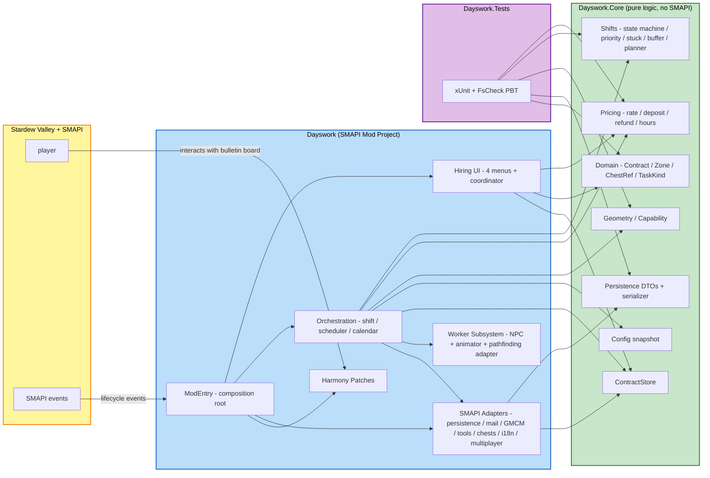

# Application Design — Dayswork (Consolidated)

> This document is the entry point to the Application Design stage. It ties together [components.md](components.md), [component-methods.md](component-methods.md), [services.md](services.md), and [component-dependency.md](component-dependency.md).
>
> **📎 Verification addendum**: After producing this design, we cross-checked it against the current Stardew/SMAPI wiki and source. Findings live in [design-verification-notes.md](design-verification-notes.md) — 8 minor adjustments captured (V1–V8), 1 user decision needed (V9 — mail-attachment strategy), 4 items deferred to Construction. Core architecture (D1–D6) is unchanged.

---

## Architectural decisions (locked in via D1–D6)

| Question | Decision | Why |
|---|---|---|
| **D1 Pure-logic separation** | Separate `Dayswork.Core` project, zero SMAPI refs | Mechanically enforces NFR-MAINT-01; PBT obligations from S-19 land trivially |
| **D2 Composition** | Hand-wired in `ModEntry.Entry()`; no DI container | Standard for SMAPI mods; explicit; no new dependencies |
| **D3 Shift orchestrator** | Explicit state machine in Core; intents executed by Mod-side orchestrator | Testable state-transition function; matches stuck-escalation language in spec |
| **D4 Config access** | Immutable `IConfigSnapshot` injected per shift | FR-PAY-08 says rate changes apply next morning — snapshot semantics enforce that at the type level |
| **D5 Eventing** | Direct method calls in fixed order; no event bus in v1 | Few fan-out points; orchestrator readability beats abstraction overhead |
| **D6 UI menus** | Four separate `IClickableMenu` subclasses + `HiringFlowCoordinator` | Screen 2 alone justifies its own class; gamepad-focus management cleaner |

---

## High-level architecture diagram



### Text fallback

```
+--------------------------+         +--------------------------------+
|  Stardew Valley + SMAPI  |         |       Dayswork.Tests           |
|  (player, events)        |         |       (xUnit + FsCheck)        |
+--------------------------+         +--------------------------------+
            |                                       |
            v                                       v references only Core
+------------------------------------+   +----------------------------+
|        Dayswork (SMAPI mod)        |   |   Dayswork.Core            |
|  - ModEntry (composition root)     |-->|   (NO SMAPI references)    |
|  - Hiring UI (4 menus + coord)     |   |   - Pricing                |
|  - Worker subsystem (NPC, anim)    |   |   - Domain                 |
|  - Orchestration (shift, sched,    |   |   - Shifts (state machine) |
|    calendar)                       |   |   - Geometry / Capability  |
|  - SMAPI adapters                  |   |   - Config snapshot        |
|    (persistence, mail, GMCM,       |   |   - Persistence (DTOs +    |
|     tools, chests, i18n, MP)       |   |     serializer)            |
|  - Harmony patches                 |   |   - ContractStore          |
+------------------------------------+   +----------------------------+
```

---

## Component inventory at a glance

- **14 Core components** (testable without launching the game):
  RateCalculator · DepositCalculator · RefundCalculator · HoursEstimator · ZoneGeometry · CapabilityEvaluator · TaskPriorityOrderer · ShiftStateMachine · StuckDetector · ItemBuffer · DepositPlanner · ContractStore · SaveDataSerializer · ConfigSnapshot

- **21 Mod components** (SMAPI-bound):
  ModEntry · BulletinBoardPatch · HiringFlowCoordinator · TaskSelectionMenu · ZoneAndChestMenu · ScheduleMenu · SummaryMenu · ZoneDrawOverlay · FarmhandNpc · ToolSwapAnimator · PathFindControllerAdapter · ShiftOrchestrator · RecurringContractScheduler · CalendarHandlers · ContractPersistenceAdapter · MailDispatcher · GMCMRegistrar · MultiplayerGuard · ToolLevelReader · ChestResolver · I18nHelper

- **6 Services** (orchestrators that sequence components):
  S-A ModEntry composition · S-B HiringFlowCoordinator · S-C ShiftOrchestrator · S-D RecurringContractScheduler · S-E ContractPersistenceAdapter · S-F MailDispatcher

See [components.md](components.md) for purpose and responsibilities, [component-methods.md](component-methods.md) for interface signatures, [services.md](services.md) for orchestration sequences, [component-dependency.md](component-dependency.md) for the dependency graph.

---

## Mapping back to requirements

Every FR group from `requirements.md §2` maps to at least one Core or Mod component:

| FR group | Primary components |
|---|---|
| §2.1 Hiring entry point and menu | M-02 BulletinBoardPatch, M-03 HiringFlowCoordinator, M-04 through M-08 menus + overlay, M-20 ChestResolver |
| §2.2 Tasks | M-12 ShiftOrchestrator + intent dispatch |
| §2.3 Worker arrival / shift loop | C-08 ShiftStateMachine, M-09 FarmhandNpc, M-11 PathFindControllerAdapter, M-12 ShiftOrchestrator |
| §2.4 Skipped objects | C-06 CapabilityEvaluator, C-07 TaskPriorityOrderer |
| §2.5 Tool inheritance | M-19 ToolLevelReader, C-06 CapabilityEvaluator |
| §2.6 Output, deposit, fallback | C-10 ItemBuffer, C-11 DepositPlanner, M-20 ChestResolver, M-16 MailDispatcher |
| §2.7 Pricing | C-01 RateCalculator, C-02 DepositCalculator, C-03 RefundCalculator, C-04 HoursEstimator |
| §2.8 Day & calendar edges | M-14 CalendarHandlers, M-13 RecurringContractScheduler |
| §2.9 Worker NPC behavior | M-09 FarmhandNpc, M-10 ToolSwapAnimator |
| §2.10 Persistence | C-12 ContractStore, C-13 SaveDataSerializer, M-15 ContractPersistenceAdapter |
| §2.11 Multiplayer | M-18 MultiplayerGuard |
| §2.12 Config & UX | C-14 IConfigSnapshot, M-17 GMCMRegistrar, M-21 I18nHelper |
| §2.13 Mod compatibility | (docs only — README) |
| NFR-MAINT (testability) | Project structure itself (Core / Mod / Tests split) |
| NFR-SAFE | C-10 ItemBuffer, M-16 MailDispatcher (mail fallback) |
| NFR-UX | M-21 I18nHelper |
| NFR-PERF | C-08 ShiftStateMachine + single tile-scan-at-zone-entry pattern (covered in per-unit Functional Design) |

No FR or NFR is left without a component.

---

## What is intentionally NOT decided here

These belong to later stages and are flagged so they don't get answered prematurely:

- **Detailed business rules per component** — Functional Design (per-unit, Construction)
- **Performance budgets per component** — NFR Requirements (per-unit, Construction)
- **Pattern selection per component** (e.g., immutable record vs mutable class for which DTOs, specific FsCheck generator design) — NFR Design / Functional Design (per-unit)
- **File layout within each project** — Code Generation planning (per-unit)
- **Asset file structure** (sprite atlases, i18n key naming convention) — Code Generation planning

---

## Risks called out in Workflow Planning, now addressed

1. **Coupling pure logic to game runtime** → Addressed by D1 separate Core project + project-reference enforcement.
2. **Worker shift orchestration sprawling** → Addressed by D3 explicit state machine in Core + thin SMAPI orchestrator that executes intents.
3. **Harmony patch conflicts** → Addressed by NFR-MAINT-04 (single namespace) + only one patch (BulletinBoardPatch) in v1.
