# Component Dependencies — Dayswork

## Dependency rules (architecturally enforced)

1. **`Dayswork.Core` may not reference SMAPI / StardewValley assemblies.** Enforced at the project file level — only `Newtonsoft.Json` as an outside dependency. Violations are a compile error.
2. **`Dayswork.Tests` references only `Dayswork.Core`.** Catches accidental SMAPI coupling at test build time.
3. **`Dayswork` (the mod project) references both `Dayswork.Core` and SMAPI/Stardew.** All adapters / orchestration live here.
4. **Direction**: SMAPI-facing components depend on Core abstractions, not vice versa. Core does not know about SMAPI events, NPCs, menus, or game state.
5. **Composition is hand-wired in `ModEntry.Entry()` (D2).** No DI container, no service locator.

---

## Dependency diagram (Mermaid)

```mermaid
flowchart TD
    subgraph SMAPI["SMAPI Runtime (external)"]
        smapi_events[GameLoop / Display / Input events]
        smapi_data[Helper.Data]
        smapi_mail[Helper.Mail]
        smapi_translation[Helper.Translation]
        harmony[Harmony]
        gmcm[GenericModConfigMenu - optional]
        game1[Game1 - player, weather, location, npcs]
    end

    subgraph Core["Dayswork.Core (no SMAPI refs)"]
        rate[RateCalculator]
        deposit[DepositCalculator]
        refund[RefundCalculator]
        hours[HoursEstimator]
        geom[ZoneGeometry]
        caps[CapabilityEvaluator]
        order[TaskPriorityOrderer]
        machine[ShiftStateMachine]
        stuck[StuckDetector]
        buffer[ItemBuffer]
        planner[DepositPlanner]
        store[ContractStore]
        serializer[SaveDataSerializer]
        config[IConfigSnapshot]
        defaults[ConfigDefaults]
    end

    subgraph Mod["Dayswork (SMAPI mod)"]
        entry[ModEntry]
        patch[BulletinBoardPatch]
        coord[HiringFlowCoordinator]
        m1[TaskSelectionMenu]
        m2[ZoneAndChestMenu]
        m3[ScheduleMenu]
        m4[SummaryMenu]
        overlay[ZoneDrawOverlay]
        npc[FarmhandNpc]
        anim[ToolSwapAnimator]
        path[PathFindControllerAdapter]
        orch[ShiftOrchestrator]
        sched[RecurringContractScheduler]
        cal[CalendarHandlers]
        persist[ContractPersistenceAdapter]
        mail[MailDispatcher]
        gmcmreg[GMCMRegistrar]
        guard[MultiplayerGuard]
        tools[ToolLevelReader]
        chests[ChestResolver]
        i18n[I18nHelper]
    end

    smapi_events --> entry
    entry --> patch
    entry --> coord
    entry --> orch
    entry --> sched
    entry --> cal
    entry --> persist
    entry --> mail
    entry --> gmcmreg
    entry --> guard
    entry --> tools
    entry --> chests
    entry --> i18n

    patch --> coord
    patch --> guard

    coord --> m1
    coord --> m2
    coord --> m3
    coord --> m4
    coord --> rate
    coord --> hours
    coord --> deposit
    coord --> store
    coord --> chests
    coord --> game1

    m2 --> overlay
    m2 --> chests

    sched --> store
    sched --> cal
    sched --> rate
    sched --> deposit
    sched --> hours
    sched --> orch
    sched --> mail
    sched --> guard
    sched --> tools
    sched --> game1

    orch --> machine
    orch --> stuck
    orch --> buffer
    orch --> planner
    orch --> caps
    orch --> order
    orch --> refund
    orch --> npc
    orch --> path
    orch --> anim
    orch --> chests
    orch --> mail
    orch --> game1

    cal --> orch
    cal --> store

    persist --> store
    persist --> serializer
    persist --> smapi_data

    mail --> smapi_mail
    mail --> i18n

    gmcmreg --> gmcm
    gmcmreg --> i18n
    gmcmreg --> config

    i18n --> smapi_translation

    patch -.-> harmony
    npc -.-> game1
    path -.-> game1
    tools -.-> game1
    chests -.-> game1

    style Core fill:#C8E6C9,stroke:#2E7D32,stroke-width:2px,color:#000
    style Mod fill:#BBDEFB,stroke:#1565C0,stroke-width:2px,color:#000
    style SMAPI fill:#FFF59D,stroke:#F57F17,stroke-width:2px,color:#000
```



---

## Text fallback — adjacency list

For accessibility / parser fallback:

**Inbound to Core components** (who reads / calls them):
- `RateCalculator` ← HiringFlowCoordinator, RecurringContractScheduler
- `DepositCalculator` ← HiringFlowCoordinator, RecurringContractScheduler
- `RefundCalculator` ← ShiftOrchestrator
- `HoursEstimator` ← HiringFlowCoordinator, RecurringContractScheduler
- `ZoneGeometry` ← HoursEstimator (Core-internal), ShiftOrchestrator
- `CapabilityEvaluator` ← ShiftOrchestrator
- `TaskPriorityOrderer` ← ShiftOrchestrator
- `ShiftStateMachine` ← ShiftOrchestrator (one instance per shift)
- `StuckDetector` ← ShiftOrchestrator
- `ItemBuffer` ← ShiftOrchestrator
- `DepositPlanner` ← ShiftOrchestrator
- `ContractStore` ← HiringFlowCoordinator, RecurringContractScheduler, CalendarHandlers, ContractPersistenceAdapter
- `SaveDataSerializer` ← ContractPersistenceAdapter
- `IConfigSnapshot` ← (passed by value almost everywhere)
- `ConfigDefaults` ← ModEntry

**Inbound to Mod components**:
- `ModEntry` ← SMAPI (lifecycle entry point)
- `BulletinBoardPatch` ← Harmony (via patch dispatch)
- `HiringFlowCoordinator` ← BulletinBoardPatch
- 4 menu classes ← HiringFlowCoordinator
- `ZoneDrawOverlay` ← ZoneAndChestMenu
- `FarmhandNpc` ← ShiftOrchestrator (constructs at shift start)
- `ToolSwapAnimator` ← ShiftOrchestrator (constructs per shift)
- `PathFindControllerAdapter` ← ShiftOrchestrator
- `ShiftOrchestrator` ← RecurringContractScheduler, CalendarHandlers
- `RecurringContractScheduler` ← SMAPI DayStarted via ModEntry
- `CalendarHandlers` ← SMAPI Saving via ModEntry, RecurringContractScheduler, ShiftOrchestrator
- `ContractPersistenceAdapter` ← SMAPI SaveLoaded / Saving via ModEntry
- `MailDispatcher` ← ShiftOrchestrator, RecurringContractScheduler
- `GMCMRegistrar` ← ModEntry (once at startup)
- `MultiplayerGuard` ← ModEntry, BulletinBoardPatch, RecurringContractScheduler
- `ToolLevelReader` ← RecurringContractScheduler, ShiftOrchestrator
- `ChestResolver` ← HiringFlowCoordinator, ZoneAndChestMenu, ShiftOrchestrator
- `I18nHelper` ← every component that emits player-visible strings

---

## Coupling assessment

| Concern | Status |
|---|---|
| **Cycles** | None. Dependency arrows are strictly Mod → Core, never Core → Mod. Within Mod, orchestrators call adapters/components; no back-calls. |
| **God-objects** | None. The two largest classes are `ModEntry` (composition only, no logic) and `ShiftOrchestrator` (~10 collaborators but a clear sequencing role). |
| **Hidden dependencies** | None. Static singletons explicitly avoided per D2. All dependencies passed via constructors. |
| **SMAPI leakage into Core** | Enforced at project boundary — Core has no SMAPI assembly reference, so a leak fails to compile. |
| **Test isolation** | `Dayswork.Tests` builds against only Core, so all Core components are testable without launching Stardew. Mod components are play-tested manually + spot-covered with light xUnit where worthwhile. |

---

## Data flow at a glance

```
Hiring flow:
  player → BulletinBoardPatch → HiringFlowCoordinator → 4 menus
                                                       → ContractStore.Add()
                                                       → Game1.player.Money -= deposit

Daily lifecycle:
  SMAPI DayStarted → RecurringContractScheduler
                       ↳ for each contract:
                          → guards (festival / multiplayer / can-afford)
                          → ShiftOrchestrator.StartShift(contract, tools, config)

Per-shift execution:
  SMAPI UpdateTicked → ShiftOrchestrator
                         → ShiftStateMachine.Step(event)
                         → dispatch returned intents (move / task / emote / deposit / refund / exit)

Per-shift conclusion:
  intent ApplyRefund → Game1.player.Money += refund
  intent QueueMail   → MailDispatcher → SMAPI mail next morning

Save/load:
  SMAPI SaveLoaded → ContractPersistenceAdapter.Deserialize → ContractStore.Hydrate
  SMAPI Saving     → ContractPersistenceAdapter.Serialize ← ContractStore.List
                  + CalendarHandlers.OnSavingHook → ShiftOrchestrator (sleep fast-forward if mid-shift)
```
