# Component Dependencies — Dayswork Pricing Model Redesign

## Dependency Rules

1. `Dayswork.Core` may not reference SMAPI or StardewValley assemblies.
2. `Dayswork.Tests` references only `Dayswork.Core`.
3. `Dayswork` references `Dayswork.Core` plus SMAPI/Stardew APIs.
4. Dependency direction remains **Mod -> Core**, never Core -> Mod.
5. Composition is still hand-wired in `ModEntry.Entry()`.
6. The fixed-price and energy redesign must remain testable through pure Core seams.

---

## Dependency Diagram (Mermaid)

```mermaid
flowchart TD
    subgraph smapi["SMAPI Runtime"]
        smapiEvents["GameLoop / Display / Input events"]
        smapiData["Helper.Data"]
        smapiMail["Mail / MFM"]
        smapiTranslation["Helper.Translation"]
        harmony["Harmony"]
        gmcm["GMCM (optional)"]
        game1["Game1 / locations / NPCs"]
    end

    subgraph core["Dayswork.Core"]
        scope["WorkScopeClassifier"]
        bands["OutdoorServiceBandClassifier"]
        price["ContractPriceCalculator"]
        breakdown["PriceBreakdownBuilder"]
        energyProfile["WorkerEnergyProfileBuilder"]
        terms["ContractTermsBuilder"]
        energyLedger["WorkerEnergyLedger"]
        geom["ZoneGeometry"]
        caps["CapabilityEvaluator"]
        order["TaskPriorityOrderer"]
        machine["ShiftStateMachine"]
        stuck["StuckDetector"]
        buffer["ItemBuffer"]
        planner["DepositPlanner"]
        store["ContractStore"]
        serializer["SaveDataSerializer"]
        config["ConfigSnapshot"]
        defaults["ConfigDefaults"]
    end

    subgraph mod["Dayswork"]
        entry["ModEntry"]
        patch["BulletinBoardPatch"]
        coord["HiringFlowCoordinator"]
        menu1["TaskSelectionMenu"]
        menu2["ZoneAndChestMenu"]
        menu3["ScheduleMenu"]
        menu4["SummaryMenu"]
        overlay["ZoneDrawOverlay"]
        npc["FarmhandNpc"]
        anim["ToolSwapAnimator"]
        path["PathFindControllerAdapter"]
        orch["ShiftOrchestrator"]
        sched["RecurringContractScheduler"]
        cal["CalendarHandlers"]
        persist["ContractPersistenceAdapter"]
        mail["MailDispatcher"]
        gmcmreg["GMCMRegistrar"]
        guard["MultiplayerGuard"]
        tools["ToolLevelReader"]
        chests["ChestResolver"]
        i18n["I18nHelper"]
    end

    smapiEvents --> entry
    entry --> patch
    entry --> coord
    entry --> orch
    entry --> sched
    entry --> cal
    entry --> persist
    entry --> mail
    entry --> gmcmreg
    entry --> guard
    entry --> tools
    entry --> chests
    entry --> i18n
    entry --> defaults

    patch --> coord
    patch --> guard

    coord --> terms
    coord --> store
    coord --> chests
    coord --> game1
    coord --> menu1
    coord --> menu2
    coord --> menu3
    coord --> menu4
    menu2 --> overlay

    terms --> scope
    terms --> bands
    terms --> price
    terms --> breakdown
    terms --> energyProfile
    terms --> config

    sched --> store
    sched --> terms
    sched --> orch
    sched --> cal
    sched --> mail
    sched --> guard
    sched --> game1

    orch --> machine
    orch --> energyLedger
    orch --> caps
    orch --> order
    orch --> stuck
    orch --> buffer
    orch --> planner
    orch --> npc
    orch --> path
    orch --> anim
    orch --> chests
    orch --> mail
    orch --> game1

    cal --> orch
    cal --> game1

    persist --> store
    persist --> serializer
    persist --> smapiData

    mail --> smapiMail
    mail --> i18n

    gmcmreg --> gmcm
    gmcmreg --> i18n
    gmcmreg --> config

    i18n --> smapiTranslation

    patch -.-> harmony
    npc -.-> game1
    path -.-> game1
    tools -.-> game1
    chests -.-> game1

    style core fill:#C8E6C9,stroke:#2E7D32,stroke-width:2px,color:#000
    style mod fill:#BBDEFB,stroke:#1565C0,stroke-width:2px,color:#000
    style smapi fill:#FFF59D,stroke:#F57F17,stroke-width:2px,color:#000
```



---

## Text Fallback — Adjacency Summary

### Core inbound callers
- `WorkScopeClassifier` <- `ContractTermsBuilder`
- `OutdoorServiceBandClassifier` <- `ContractTermsBuilder`
- `ContractPriceCalculator` <- `ContractTermsBuilder`
- `PriceBreakdownBuilder` <- `ContractTermsBuilder`
- `WorkerEnergyProfileBuilder` <- `ContractTermsBuilder`
- `ContractTermsBuilder` <- `HiringFlowCoordinator`, `RecurringContractScheduler`
- `WorkerEnergyLedger` <- `ShiftOrchestrator`
- `ZoneGeometry` <- scope/pricing helpers and runtime scanners
- `CapabilityEvaluator` <- `ShiftOrchestrator`
- `TaskPriorityOrderer` <- `ShiftOrchestrator`
- `ShiftStateMachine` <- `ShiftOrchestrator`
- `StuckDetector` <- `ShiftOrchestrator`
- `ItemBuffer` <- `ShiftOrchestrator`
- `DepositPlanner` <- `ShiftOrchestrator`
- `ContractStore` <- `HiringFlowCoordinator`, `RecurringContractScheduler`, `ContractPersistenceAdapter`
- `SaveDataSerializer` <- `ContractPersistenceAdapter`
- `ConfigSnapshot` <- `ContractTermsBuilder`, `GMCMRegistrar`, `ModEntry`
- `ConfigDefaults` <- `ModEntry`

### Mod inbound callers
- `ModEntry` <- SMAPI
- `BulletinBoardPatch` <- Harmony/entry wiring
- `HiringFlowCoordinator` <- `BulletinBoardPatch`
- `TaskSelectionMenu`, `ZoneAndChestMenu`, `ScheduleMenu`, `SummaryMenu` <- `HiringFlowCoordinator`
- `ZoneDrawOverlay` <- `ZoneAndChestMenu`
- `FarmhandNpc` <- `ShiftOrchestrator`
- `ToolSwapAnimator` <- `ShiftOrchestrator`
- `PathFindControllerAdapter` <- `ShiftOrchestrator`
- `ShiftOrchestrator` <- `RecurringContractScheduler`, `CalendarHandlers`, SMAPI tick/time events
- `RecurringContractScheduler` <- SMAPI `DayStarted`
- `CalendarHandlers` <- SMAPI `Saving`, `RecurringContractScheduler`
- `ContractPersistenceAdapter` <- SMAPI save events
- `MailDispatcher` <- `RecurringContractScheduler`, `ShiftOrchestrator`
- `GMCMRegistrar` <- `ModEntry`
- `MultiplayerGuard` <- `ModEntry`, `BulletinBoardPatch`, `RecurringContractScheduler`
- `ToolLevelReader` <- `ShiftOrchestrator`
- `ChestResolver` <- `HiringFlowCoordinator`, `ShiftOrchestrator`
- `I18nHelper` <- UI/config/mail components

---

## Coupling Assessment

| Concern | Status |
|---|---|
| **Core purity** | Preserved. The pricing/energy redesign remains entirely expressible without SMAPI references. |
| **Cycles** | None introduced. The main shape is still Mod -> Core, with no reverse dependency. |
| **UI/business-logic leakage** | Reduced. Menus no longer assemble pricing themselves; they depend on `ContractTermsBuilder` through the coordinator. |
| **Runtime/billing entanglement** | Reduced. `ShiftOrchestrator` consumes stored terms and energy state; it no longer calculates refunds or settlement billing. |
| **Legacy-save complexity** | Intentionally minimized. Serializer drops legacy pre-release contracts instead of trying to migrate them. |

---

## Data Flow At A Glance

```text
Hiring preview:
  player
    -> BulletinBoardPatch
    -> HiringFlowCoordinator
    -> ContractTermsBuilder
       -> WorkScopeClassifier
       -> OutdoorServiceBandClassifier
       -> ContractPriceCalculator
       -> PriceBreakdownBuilder
       -> WorkerEnergyProfileBuilder
    -> menus render ContractPreview

One-time confirmation:
  SummaryMenu confirm
    -> HiringFlowCoordinator
    -> ContractTermsSnapshot persisted in ContractStore
    -> Game1.player.Money -= fixed total price

Recurring day start:
  SMAPI DayStarted
    -> RecurringContractScheduler
    -> ContractTermsBuilder.RebuildTerms(...)
    -> ContractStore.ReplaceTermsSnapshot(...)
    -> affordability check
    -> fixed daily charge
    -> ShiftOrchestrator.StartShift(...)

Shift runtime:
  UpdateTicked / TimeChanged
    -> ShiftOrchestrator
    -> ShiftStateMachine
    -> WorkerEnergyLedger
    -> deposit/exit intents

Persistence:
  SaveLoaded
    -> ContractPersistenceAdapter
    -> SaveDataSerializer.Deserialize(...)
    -> legacy contracts silently dropped if old schema
    -> ContractStore hydration
```
