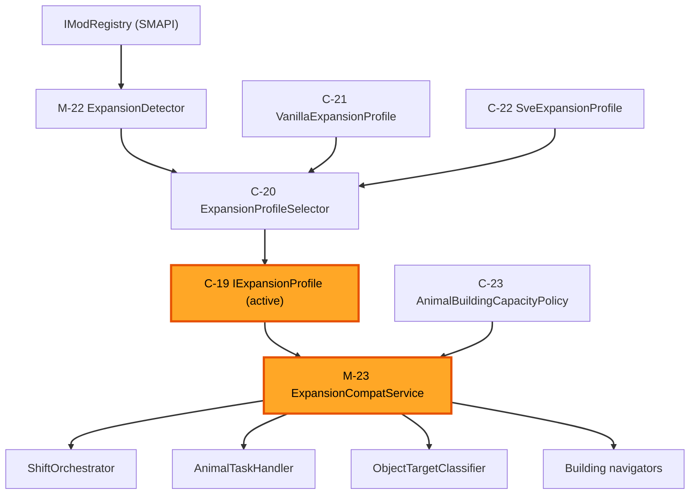

# Application Design — Stardew Valley Expanded (SVE) Compatibility

**Scope**: This is a change-scoped addendum to the project Application Design ([components.md](components.md), [services.md](services.md), [component-methods.md](component-methods.md), [component-dependency.md](component-dependency.md)). It adds the **expansion-compatibility provider seam** and its consumers. Existing components are unchanged except for the explicitly listed call-site delegations.

**Decisions (from the approved design plan, all option A)**:
- **Q1** — pure `ExpansionProfile` + pure `ExpansionProfileSelector` in Core, wrapped by a thin Mod-side `ExpansionCompatService`.
- **Q2** — SVE-specific data lives in `Dayswork.Core` as pure, testable data (centralized; NFR-SVE-07).
- **Q3** — a **general** `AnimalBuildingCapacityPolicy` used by vanilla and SVE.
- **Q4** — SVE provider **maps premium buildings to their nearest vanilla tier** for scope/pricing; no `AnimalBuildingTier` enum change, no new price keys, no save-schema change.
- **Q5** — consumers receive `ExpansionCompatService` via **constructor injection** from the `ModEntry` composition root.

> **Grounding note (NFR-SVE-03)**: Component *shapes* are fixed here. Concrete SVE values (exact entrance tiles per map, Grandpa's Shed interior task set, custom clump indices, new milk/wool animal types) are confirmed from SVE source during per-unit Functional Design / Code Generation, and populate `SveExpansionProfile`.

---

## 1. Components

### Core (`Dayswork.Core/Compat/`) — pure, no SMAPI/Stardew refs

#### C-19 IExpansionProfile
- **Purpose**: Immutable description of one expansion's compatibility data plus the pure lookups over it.
- **Responsibilities**:
  - Identify the profile (`Id`) and the farm-map mod IDs it covers.
  - Pure lookups: entrance override by farm identity; content-classification override by descriptor; expansion work-location membership by location name; premium-building → nearest-vanilla-tier mapping.
  - Hold no live game objects — operates only on primitive descriptors.
- **Interface**: `IExpansionProfile`

#### C-20 ExpansionProfileSelector
- **Purpose**: Deterministically pick the active profile from the set of installed mod IDs.
- **Responsibilities**:
  - Return `SveExpansionProfile` when SVE content is present, else `VanillaExpansionProfile`.
  - Be a pure function of its input set (stable, deterministic — S-26 PBT).
  - Be open to additional profiles without changing callers.
- **Interface**: `ExpansionProfileSelector` (could expose `IExpansionProfile Select(IReadOnlySet<string> installedModIds)`)

#### C-21 VanillaExpansionProfile
- **Purpose**: The default profile representing "no expansion overrides."
- **Responsibilities**:
  - Every lookup returns "no override" / `false` / `null` so all behavior falls through to existing vanilla logic (guarantees NFR-SVE-01 / S-21).
- **Interface**: `IExpansionProfile`

#### C-22 SveExpansionProfile
- **Purpose**: SVE's concrete compatibility data — the single home for all SVE identifiers (NFR-SVE-07).
- **Responsibilities**:
  - Hold SVE mod IDs (`FlashShifter.StardewValleyExpandedCP`, `FlashShifter.SVECode`) and supported farm-map IDs (`flashshifter.immersivefarm2remastered`, `flashshifter.GrandpasFarm`, `flashshifter.FrontierFarm`).
  - Hold the per-map entrance-override table, premium-building-type → vanilla-tier map (Premium Coop → DeluxeCoop, Premium Barn → DeluxeBarn), content-classification overrides, and Grandpa's Shed location identity.
  - Provide these as pure data; concrete values verified from SVE source per unit.
- **Interface**: `IExpansionProfile`

#### C-23 AnimalBuildingCapacityPolicy
- **Purpose**: Derive an animal building's feeding capacity from its real data instead of the hardcoded `Deluxe=12 / Big=8 / else=4` ladder.
- **Responsibilities**:
  - Compute capacity from primitive inputs (actual trough-tile count and/or `MaxOccupants`).
  - Be a pure function used by both vanilla and SVE buildings (general correctness fix — Q3, S-23).
  - Be deterministic (S-26 PBT).
- **Interface**: `AnimalBuildingCapacityPolicy` (pure)

### Mod (`Dayswork/Compat/`) — SMAPI-bound

#### M-22 ExpansionDetector
- **Purpose**: Discover which expansions are installed via SMAPI.
- **Responsibilities**:
  - Query `IModRegistry.IsLoaded(...)` for the known expansion IDs and build the installed-ID set.
  - Hand the set to `ExpansionProfileSelector` and expose/return the active profile.
  - Log the active profile once at startup (debug) for diagnosis (S-21).
- **Depends on**: `IModRegistry`, `ExpansionProfileSelector`.

#### M-23 ExpansionCompatService
- **Purpose**: The single runtime seam. Holds the active `IExpansionProfile` and applies it to live game objects; vanilla-identical when the profile is the default.
- **Responsibilities**:
  - Entrance: provide a per-map entrance **override** when one exists (caller keeps the `Farm.warps` heuristic as default — FR-SVE-06).
  - Animal buildings: resolve feed capacity (via `AnimalBuildingCapacityPolicy` + live trough/occupant data) and map a live premium building to its pricing/scope tier (Q4).
  - Content: offer a classification override for a given live object/clump/animal, else "no override" (caller falls through to existing classification — FR-SVE-13/15).
  - Work locations: report whether a location is an expansion work location (e.g., Grandpa's Shed — FR-SVE-14).
  - Expose `ActiveProfileId` for logging.
- **Depends on**: `IExpansionProfile` (active), `AnimalBuildingCapacityPolicy`, `IMonitor`.

---

## 2. Component Methods (high-level; business rules deferred to Functional Design)

> Signatures use types already present in the codebase (`Farm`, `AnimalHouse`, `GameLocation`, `Building`, `Point`, `TileCoord`, `AnimalBuildingTier`). Exact parameter/return types are finalized per unit in Functional Design / Code Generation.

**C-19 `IExpansionProfile`** (pure)
- `string Id { get; }`
- `IReadOnlySet<string> FarmMapModIds { get; }`
- `bool TryGetEntranceOverride(string farmIdentity, out TileCoord tile)`
- `bool TryClassifyContentOverride(ContentDescriptor descriptor, out WorkClassification result)`
- `bool IsExpansionWorkLocation(string locationName)`
- `AnimalBuildingTier? MapPremiumBuildingTier(string buildingType)`

**C-20 `ExpansionProfileSelector`** (pure)
- `IExpansionProfile Select(IReadOnlySet<string> installedModIds)`

**C-23 `AnimalBuildingCapacityPolicy`** (pure)
- `int DeriveCapacity(AnimalBuildingCapacityInputs inputs)` where `AnimalBuildingCapacityInputs` is a pure record of `(int TroughTileCount, int MaxOccupants)` (and any building-data hint). Returns the number of feed slots to fill.

**M-22 `ExpansionDetector`**
- `IReadOnlySet<string> CollectInstalledExpansionIds()`
- `IExpansionProfile ResolveActiveProfile()` (uses the selector; logs once)

**M-23 `ExpansionCompatService`**
- `string ActiveProfileId { get; }`
- `bool TryGetFarmEntranceOverride(GameLocation farm, out Point tile)`
- `int ResolveAnimalFeedCapacity(AnimalHouse house)`
- `AnimalBuildingTier ResolveAnimalBuildingTier(Building building, AnimalBuildingTier vanillaTier)`
- `bool TryClassifyContentOverride(GameLocation loc, TileCoord tile, out WorkClassification result)`
- `bool IsExpansionWorkLocation(GameLocation location)`

New pure helper types introduced: `ContentDescriptor`, `WorkClassification`, `AnimalBuildingCapacityInputs` (all in `Dayswork.Core/Compat/`).

---

## 3. Services / Orchestration additions

### Composition-root wiring (extends S-A — ModEntry)
Insert into the existing `ModEntry` startup sequence (after Core singletons, before/with the Mod singletons that consume it):
1. Construct Core compat singletons: `VanillaExpansionProfile`, `SveExpansionProfile`, `ExpansionProfileSelector`, `AnimalBuildingCapacityPolicy`.
2. Construct `ExpansionDetector(helper.ModRegistry, selector)` and call `ResolveActiveProfile()` → logs the active profile once.
3. Construct `ExpansionCompatService(activeProfile, capacityPolicy, Monitor)`.
4. Inject `ExpansionCompatService` into the consumers that need it (constructor injection — Q5): `ShiftOrchestrator`, `AnimalTaskHandler`, `ObjectTargetClassifier` usage site, and the building navigators.

### Runtime usage (no new top-level service; existing services delegate)
- **S-D ShiftOrchestrator** — entrance: try `compat.TryGetFarmEntranceOverride(farm, out tile)`; if false, use the existing `Farm.warps` heuristic + `(77,15)` fallback (unchanged).
- **AnimalTaskHandler** — capacity: replace `FeedCapacity(buildingType)` with `compat.ResolveAnimalFeedCapacity(house)`; premium auto-feed handled by existing trough-scan returning no work when full (no auto-machine detection — FR-SVE-09).
- **ObjectTargetClassifier** — before returning a vanilla classification (or null), consult `compat.TryClassifyContentOverride(...)`; unknown → existing skip (FR-SVE-13/15).
- **Building navigators / scope** — include `compat.IsExpansionWorkLocation(...)` locations (Grandpa's Shed) in the work-location set; map premium buildings to a vanilla tier via `compat.ResolveAnimalBuildingTier(...)` for scope/pricing.

---

## 4. Component Dependencies & vanilla-path guarantee

### Dependency diagram (Mermaid; text alternative below)

### Text alternative
- `IModRegistry` → `ExpansionDetector` → `ExpansionProfileSelector` (choosing between `VanillaExpansionProfile` and `SveExpansionProfile`) → active `IExpansionProfile`.
- `ExpansionCompatService` depends on the active `IExpansionProfile` and `AnimalBuildingCapacityPolicy`.
- `ShiftOrchestrator`, `AnimalTaskHandler`, `ObjectTargetClassifier`, and the building navigators depend on `ExpansionCompatService` only (never on the Core profiles directly).

### Vanilla-path guarantee (NFR-SVE-01)
When no expansion is installed, the selector returns `VanillaExpansionProfile`, whose lookups all report "no override." Every consumer therefore takes its existing code path:
- `TryGetFarmEntranceOverride` → false → existing warp heuristic.
- `ResolveAnimalFeedCapacity` → derived from real troughs/occupants (this is the one intentional general improvement; for standard vanilla buildings it yields the same effective result as the old ladder for the common cases, validated by tests).
- `TryClassifyContentOverride` → false → existing classifier.
- `IsExpansionWorkLocation` → false; `ResolveAnimalBuildingTier` → returns the passed vanilla tier unchanged.

### Data-model / persistence impact
- **None to save schema** — Q4=A maps premium buildings to existing vanilla tiers, so `AnimalBuildingScope`/`Selection`/`PriceKey` and the save DTOs are unchanged.

---

## 5. Extension Compliance

| Extension | Status | Application-design compliance |
|---|---|---|
| Security Baseline | Disabled | N/A — no security surface. |
| Property-Based Testing | Enabled, full | Compliant — the pure Core compat components (C-19 lookups, C-20 selection, C-23 capacity) are designed as deterministic pure functions to carry FsCheck obligations (S-26); the Mod seam (M-22/M-23) stays thin so the hard logic is testable without SMAPI. |

---

## 6. Proposed Unit Mapping (informs Units Generation)

| Component | Unit |
|---|---|
| C-19, C-20, C-21, C-22 (shell), M-22, M-23 (shell) | U-SVE-01 (provider foundation + detection) |
| Entrance override data in C-22 + `TryGetFarmEntranceOverride` consumption in `ShiftOrchestrator` | U-SVE-02 |
| C-23 + capacity/tier consumption in `AnimalTaskHandler` + premium-tier scope mapping | U-SVE-03 |
| Content-classification overrides + `IsExpansionWorkLocation` (Grandpa's Shed) consumption | U-SVE-04 |
