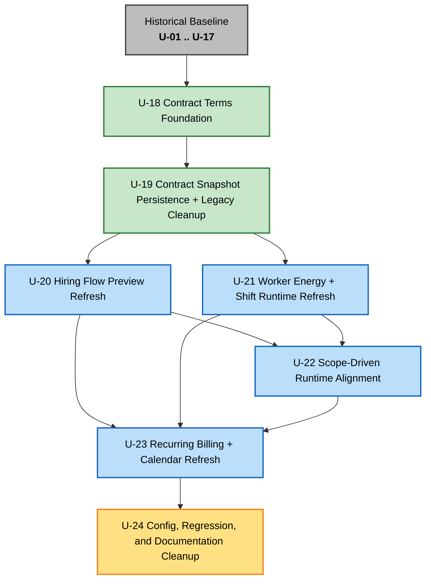
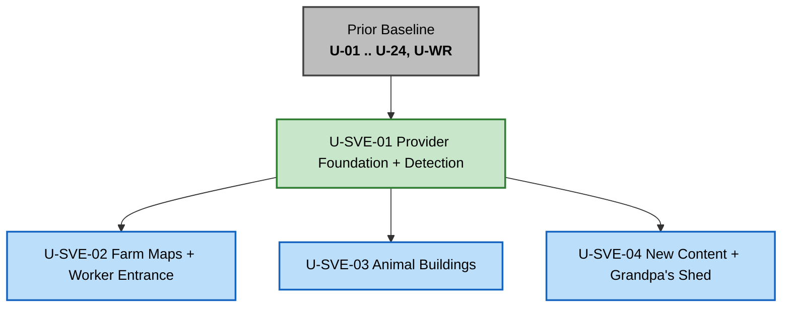

# Unit of Work Dependency — Pricing Model Redesign Retrofit

This document defines the execution order for the appended retrofit units `U-18` through `U-24`.

Historical units `U-01` through `U-17` are treated as the already-built baseline. The retrofit sequence starts only after that historical baseline.

---

## Dependency DAG (Mermaid)

**Color legend**:
- gray = historical baseline
- green = retrofit foundation
- blue = feature/runtime retrofit slices
- amber = final cleanup/regression unit

---

## Text fallback — dependency summary

| Unit | Depends on | Why |
|---|---|---|
| `U-18` Contract Terms Foundation | Historical baseline | Replaces the pricing architecture on top of the already-built mod |
| `U-19` Contract Snapshot Persistence + Legacy Cleanup | `U-18` | Persistence schema must follow the new contract-terms model |
| `U-20` Hiring Flow Preview Refresh | `U-19` | The UI should preview and confirm the persisted contract-terms shape |
| `U-21` Worker Energy + Shift Runtime Refresh | `U-19` | Runtime needs the new stored terms/energy model available on contracts |
| `U-22` Scope-Driven Runtime Alignment | `U-20`, `U-21` | Runtime scope consumption must agree with both the new UI selection model and the new energy-aware shift runtime |
| `U-23` Recurring Billing + Calendar Refresh | `U-20`, `U-21`, `U-22` | Day-start repricing and calendar rules need the final hire-flow terms shape plus runtime scope behavior |
| `U-24` Config, Regression, and Documentation Cleanup | `U-23` | Final cleanup should happen after all behavior changes settle |

---

## Recommended execution order

### Historical prerequisite
1. `U-01 .. U-17` historical baseline already exists

### Retrofit sequence
2. `U-18` Contract Terms Foundation
3. `U-19` Contract Snapshot Persistence + Legacy Cleanup
4. `U-20` Hiring Flow Preview Refresh
5. `U-21` Worker Energy + Shift Runtime Refresh
6. `U-22` Scope-Driven Runtime Alignment
7. `U-23` Recurring Billing + Calendar Refresh
8. `U-24` Config, Regression, and Documentation Cleanup

This sequence is intentionally more linear than the raw DAG because:
- it reduces context switching for a solo developer
- it lets the contract model settle before the UI and runtime both start changing
- it postpones regression/doc cleanup until behavior is stable enough to document honestly

---

## Construction loop handoff

Each retrofit unit completes the normal Construction loop before the next begins:

1. Functional Design
2. NFR Requirements
3. NFR Design
4. Infrastructure Design skipped
5. Code Generation

Only after `U-24` is approved does the redesign move to the global Build and Test stage.

---

## Risk notes by dependency edge

| Edge | Risk being controlled |
|---|---|
| `U-18 -> U-19` | Prevents persistence from guessing at an unstable contract-terms shape |
| `U-19 -> U-20` | Prevents the UI from previewing a model that cannot yet be saved correctly |
| `U-19 -> U-21` | Prevents the runtime from depending on contract data that is not yet persisted coherently |
| `U-20/U-21 -> U-22` | Prevents runtime scope consumption from drifting away from what the player selected in the refreshed UI |
| `U-20/U-21/U-22 -> U-23` | Prevents recurring lifecycle work from being built on partially updated pricing/runtime semantics |
| `U-23 -> U-24` | Prevents docs/config/regression from freezing too early while recurring behavior is still moving |

---

## Validation

- No retrofit unit depends on a later retrofit unit
- Every retrofit unit has a clear predecessor chain back to the historical baseline
- The sequence preserves the approved hybrid strategy: foundation first, then feature/runtime slices, then final cleanup

---

# SVE Compatibility Units — Dependencies (appended 2026-05-29)

The SVE-compatibility units `U-SVE-01` through `U-SVE-04` are appended after the entire prior baseline (`U-01..U-24`, `U-WR`). They depend only on existing built code, except that the three override units each depend on the foundation `U-SVE-01`. They are independent of one another.

## SVE Dependency DAG (Mermaid)

## Text fallback — dependency summary

| Unit | Depends on | Why |
|---|---|---|
| `U-SVE-01` Provider Foundation + Detection | Prior baseline | Adds the isolated compat seam on top of the already-built mod |
| `U-SVE-02` Farm Maps + Worker Entrance | `U-SVE-01` | Entrance override consumption needs the seam + SVE profile |
| `U-SVE-03` Animal Buildings | `U-SVE-01` | Capacity policy + tier mapping flow through the seam |
| `U-SVE-04` New Content + Grandpa's Shed | `U-SVE-01` | Classification/work-location overrides flow through the seam |

## Recommended execution order (unit-plan Q2=A)

1. `U-SVE-01` Provider Foundation + Detection
2. `U-SVE-02` Farm Maps + Worker Entrance — *entrance first: the worker must spawn correctly on an SVE map before other SVE behavior is observable/playtestable*
3. `U-SVE-03` Animal Buildings
4. `U-SVE-04` New Content + Grandpa's Shed

The three override units are technically parallelizable after the foundation, but a solo developer should run them sequentially in this order to keep playtesting focused.

## Construction loop handoff

Each SVE unit completes the normal Construction loop (Functional Design → NFR Requirements → NFR Design → Code Generation; Infrastructure Design skipped) before the next begins. Only after `U-SVE-04` is approved does the SVE change move to the global Build and Test stage.

## Validation

- No SVE unit depends on a later SVE unit.
- Every SVE unit has a clear predecessor chain back to the prior baseline via `U-SVE-01`.
- Foundation-first is preserved; the Vanilla profile guarantees no vanilla regression while override units are built incrementally.

---

## Manage Crops — dependency summary

| Unit | Depends on | Why |
|---|---|---|
| `U-MC-01` Domain + Persistence Foundation | Prior baseline | Shared crop-plan domain, pure planners, V3 schema — every later unit builds on it |
| `U-MC-02` Cabin Chests | `U-MC-01` | Input chest is the availability-gate reservoir referenced by domain/runtime |
| `U-MC-03` Authoring UI | `U-MC-01` | Menu reads/writes the crop-plan domain via `ContractDraft` |
| `U-MC-04` Zone Draw Overlay | `U-MC-01`, `U-MC-03` | Draw applies the authored plan; overlay launched from the authoring page |
| `U-MC-05` Shift Crop Behavior | `U-MC-01`, `U-MC-02`, `U-MC-03` | Executes the authored plan, reads the input chest, uses pure planners |
| `U-MC-06` Town Shopping | `U-MC-01`, `U-MC-05` | Shopping is triggered by the shift runner's supply assessment |
| `U-MC-07` Output Routing + Greenhouse/Shed | `U-MC-01`, `U-MC-05` | Routing/greenhouse logic layers onto the shift runner |

## Recommended execution order (unit-plan Q4=A)
1. `U-MC-01` Domain + Persistence Foundation
2. `U-MC-02` Cabin Chests
3. `U-MC-03` Authoring UI
4. `U-MC-04` Zone Draw Overlay
5. `U-MC-05` Shift Crop Behavior
6. `U-MC-06` Town Shopping
7. `U-MC-07` Output Routing + Greenhouse/Shed

Sequential for a solo developer to keep playtesting focused; U-MC-02/03/04 are technically parallelizable after U-MC-01, but the runtime units (U-MC-05..07) build on the authored plan.

## Construction loop handoff
Each Manage Crops unit completes the normal Construction loop (Functional Design → NFR Requirements → NFR Design → Code Generation; Infrastructure Design skipped) before the next begins. Only after `U-MC-07` is approved does the change move to the global Build and Test stage (Q3=A: no separate cleanup unit — final regression consolidated there).

## Validation
- No Manage Crops unit depends on a later unit.
- Every unit chains back to the foundation `U-MC-01`.
- Foundation-first preserved; the feature is opt-in (empty `CropPlan`) so no existing-behavior regression while units are built incrementally.
