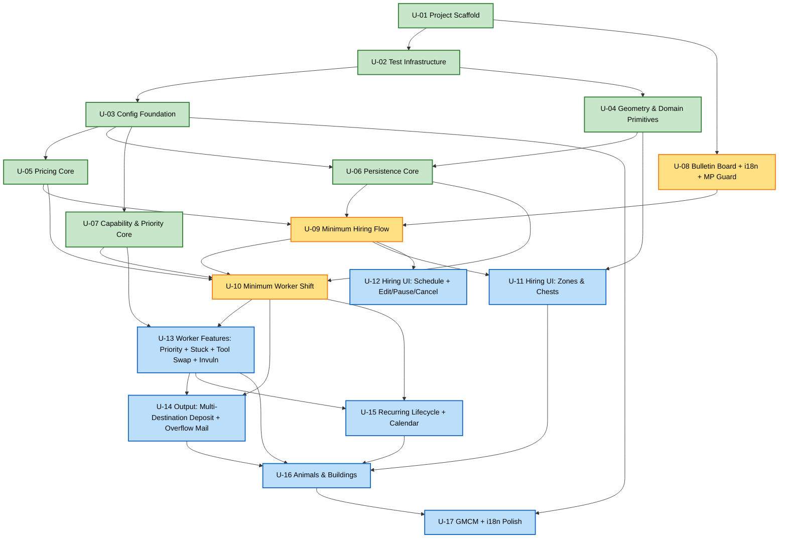
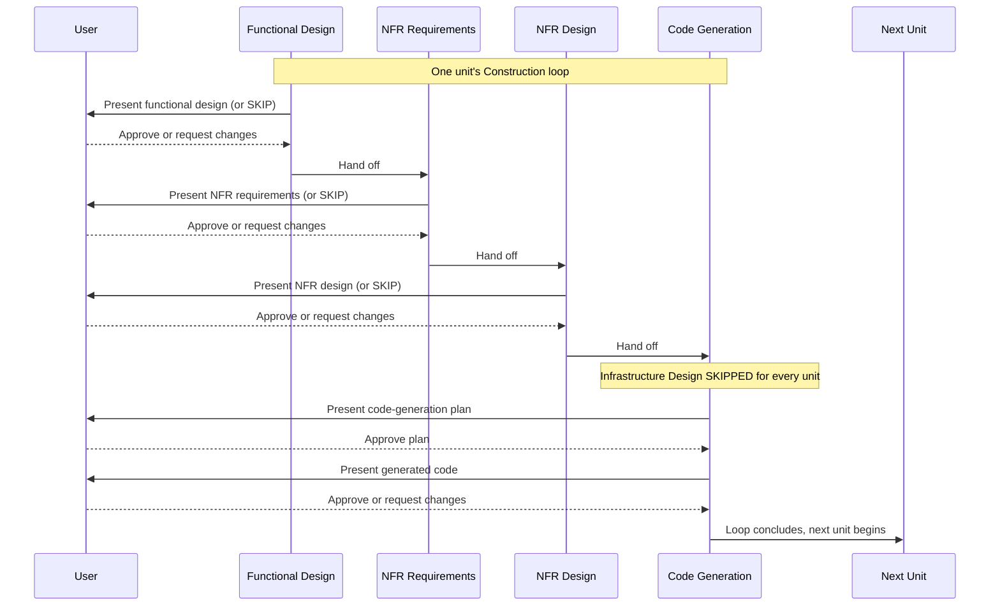

# Unit of Work Dependency — Dayswork

This document specifies the construction order for the 17 units defined in [unit-of-work.md](unit-of-work.md). Per the approved plan, **each unit completes its full Construction loop (Functional Design → NFR Requirements → NFR Design → Code Generation) before the next unit's loop begins.**

The graph here is a strict DAG: every arrow `A → B` means "unit B's Construction loop cannot start until unit A's loop is complete." There are no back-edges.

---

## Dependency DAG (Mermaid)



**Color legend**: green = Foundation phase, amber = Thin vertical slice phase, blue = Deepening phase.

---

## Text fallback — adjacency list

For accessibility and as a parser-independent reference.

**Outbound dependencies** (what this unit requires from earlier units):

| Unit | Depends on |
|---|---|
| U-01 Project Scaffold | (none — starting point) |
| U-02 Test Infrastructure | U-01 (test project lives in the solution scaffold) |
| U-03 Config Foundation | U-02 (test project must exist to add config tests) |
| U-04 Geometry & Domain Primitives | U-02 |
| U-05 Pricing Core | U-03 (uses `IConfigSnapshot`) |
| U-06 Persistence Core | U-03 (Contract record carries IConfigSnapshot-shaped data), U-04 (serializes Zone records) |
| U-07 Capability & Priority Core | U-03 (uses `IConfigSnapshot`) |
| U-08 Bulletin Board + i18n + MP Guard | U-01 (extends ModEntry scaffold) |
| U-09 Minimum Hiring Flow | U-05 (rate + estimate + deposit math for live display and summary), U-06 (ContractStore + ContractPersistenceAdapter wires through SaveDataSerializer), U-08 (i18n keys + ModEntry composition root + multiplayer short-circuit) |
| U-10 Minimum Worker Shift | U-05 (RefundCalculator at exit), U-06 (reads contracts from ContractStore), U-07 (ToolLevelReader feeds CapabilityEvaluator; TaskPriorityOrderer used by orchestrator), U-09 (RecurringContractScheduler stub triggers shifts for the persisted one-time contracts that U-09 produces) |
| U-11 Hiring UI: Zones & Chests | U-09 (extends HiringFlowCoordinator + TaskSelectionMenu data model), U-04 (uses ZoneGeometry for zone normalization and the unreachable-tile filter) |
| U-12 Hiring UI: Schedule + Edit/Pause/Cancel | U-09 (extends HiringFlowCoordinator) |
| U-13 Worker Features: Priority + Stuck + Tool Swap + Invuln | U-07 (CapabilityEvaluator + TaskPriorityOrderer become fully active), U-10 (extends ShiftStateMachine, FarmhandNpc, ShiftOrchestrator) |
| U-14 Output: Multi-Destination Deposit + Overflow Mail | U-10 (extends ShiftStateMachine Depositing state and ShiftOrchestrator intent dispatch), U-13 (deposit pipeline now sits on top of the full task-priority + capability work) |
| U-15 Recurring Lifecycle + Calendar | U-10 (extends RecurringContractScheduler stub and ShiftOrchestrator for sleep-stop settlement), U-13 (full outdoor worker behavior must exist before subjecting it to a 7-day recurring loop) |
| U-16 Animals & Buildings | U-11 (building selection/chest assignment data exists), U-13 (worker movement/task loop deepened), U-14 (output pipeline can route animal products and indoor harvests), U-15 (current lifecycle stable before adding building/animal complexity) |
| U-17 GMCM + i18n Polish | U-03 (GMCM exposes every IConfigSnapshot field), U-16 (last functional unit; lint pass runs against the whole assembly and proves S-20 holds end-to-end) |

**Inbound dependencies** (what later units this unit unblocks):

| Unit | Unblocks |
|---|---|
| U-01 | U-02, U-08 |
| U-02 | U-03, U-04 |
| U-03 | U-05, U-06, U-07, U-17 |
| U-04 | U-06, U-11 |
| U-05 | U-09, U-10 |
| U-06 | U-09, U-10 |
| U-07 | U-10, U-13 |
| U-08 | U-09 |
| U-09 | U-10, U-11, U-12 |
| U-10 | U-13, U-14, U-15 |
| U-11 | U-16 |
| U-12 | (none — terminal in deepening phase) |
| U-13 | U-14, U-15, U-16 |
| U-14 | U-16 |
| U-15 | U-16 |
| U-16 | U-17 |
| U-17 | (none — final unit) |

---

## Construction loop execution order

The DAG above admits multiple valid topological orderings. The plan recommends this specific order because it (a) finishes the foundation phase first per U4, (b) gets to a demonstrable end-to-end shift as early as possible (U-10), and (c) groups related deepening work to minimize context-switching:

```text
Foundation (no end-to-end behavior yet — earning the right to build features)
  1. U-01 Project Scaffold
  2. U-02 Test Infrastructure
  3. U-03 Config Foundation
  4. U-04 Geometry & Domain Primitives
  5. U-05 Pricing Core
  6. U-06 Persistence Core
  7. U-07 Capability & Priority Core

Thin vertical slice (proves end-to-end happy path)
  8. U-08 Bulletin Board + i18n + MP Guard
  9. U-09 Minimum Hiring Flow
 10. U-10 Minimum Worker Shift          ← FIRST PLAYABLE: hire → work → refund

Deepening (each unit takes the thin slice and adds depth)
 11. U-11 Hiring UI: Zones & Chests
 12. U-12 Hiring UI: Schedule + Edit/Pause/Cancel
 13. U-13 Worker Features: Priority + Stuck + Tool Swap + Invulnerability
 14. U-14 Output: Multi-Destination Deposit + Overflow Mail
 15. U-15 Recurring Lifecycle + Calendar
 16. U-16 Animals & Buildings
 17. U-17 GMCM + i18n Polish            ← v1 RELEASE CANDIDATE
```

**Note on U-11/U-12 ordering**: U-11 (Zones & Chests) and U-12 (Schedule + Edit/Pause/Cancel) are not interdependent and could swap places. U-11 is sequenced first because it unblocks the chest-assignment data that U-14 will eventually exercise (chests must be assignable before the mail-fallback path is interesting to test). U-12 could be deferred to immediately before U-15 if a different prioritization emerged — for example, if the developer wanted to defer the contract-management UI in favor of building worker depth earlier.

**Note on U-13/U-14 ordering**: U-14 deepens the Depositing state that U-13 left as "shipping bin only". U-13 must come first because U-14's multi-trip planner consumes the priority order + capability-aware buffer state that U-13 establishes.

---

## Construction loop interaction (per-unit lifecycle)

Each unit's Construction loop, per the approved [execution-plan.md](../plans/execution-plan.md):



**Text fallback** of the per-unit lifecycle:
1. **Functional Design** — model business rules in pseudocode/diagrams; user approves or skips
2. **NFR Requirements** — surface NFRs that bind this unit (safety, maintainability, etc.); user approves or skips
3. **NFR Design** — design patterns for those NFRs; user approves or skips
4. **Infrastructure Design** — SKIPPED for every unit (Dayswork has no cloud/IaC layer)
5. **Code Generation** — plan-then-approve, then generate code; user approves
6. Loop advances to the next unit

After U-17 completes, the **Build and Test** stage runs once across all 17 units' output (per [execution-plan.md](../plans/execution-plan.md)).

---

## Coupling / risk assessment

| Risk | Mitigation in the unit sequence |
|---|---|
| Integration issues found late (pure dependency-first risk) | U-10 forces an end-to-end happy path early — the system is observably "alive" after only 10 units, surfacing wiring problems before the deepening phase. |
| Throwaway work from demo-first stub-and-replace | The U-10 stubs (whole-farm default zone, shipping-bin default destination, basic state machine, one-time-only scheduler) are clearly bounded extensions in U-11/U-13/U-14/U-15/U-16. Each stub site is documented in [unit-of-work.md](unit-of-work.md) under "Extends". |
| Test debt accumulating because tests are bundled per-unit | U-02 stands up the test framework once. PBT obligations PBT-02/PBT-03 are concentrated in Core foundation units (U-04, U-05, U-06, U-10) where they're the primary value. Mod units add only light tests because their value comes from manual play-testing. |
| Composition root (ModEntry) becoming a god-object as it grows across 10 units | The growth is mechanical — each Mod-unit's "Extends M-01" entry adds one or two `new X(...)` statements and one or two event subscriptions. The sequence in `Entry()` is documented in [services.md](services.md) Service S-A; deviations from that order are a code-review red flag. |
| `ShiftStateMachine` (C-08) and `ShiftOrchestrator` (M-12) extended across U-10, U-13, U-14 | Per-unit Functional Design will explicitly enumerate the state-machine states being added (U-13 adds Stuck, Recovering; U-14 expands Depositing's intent set). Each PBT in U-10 continues to pass at U-13 and U-14 — regression catches accidental breakage. |

---

## Coverage checks

- ✅ **All 35 original components owned by exactly one unit** (see ownership matrix in [unit-of-work.md](unit-of-work.md)); post-design U-16 components are owned by U-16
- ✅ **All 20 stories covered by at least one delivering unit** (see [unit-of-work-story-map.md](unit-of-work-story-map.md))
- ✅ **No cycles in the dependency DAG** (every edge points from lower-numbered to higher-numbered unit)
- ✅ **Linear topological ordering exists** (the 1→17 sequence in "Construction loop execution order" above respects every edge)
