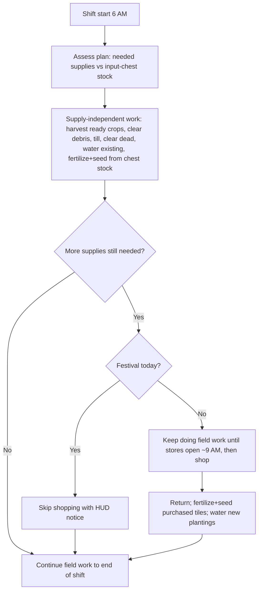

# Feature Specification: Manage Crops

**Status:** Draft (intent capture — no implementation yet)
**Phase:** Inception / Requirements
**Author:** Bindicle
**Date:** 2026-06-04
**Roadmap item:** "Advanced crop management" (post-v1)

---

## 1. Summary

Add a **Manage Crops** section to the Farmhand contract UI that lets the player
define detailed, per-zone crop plans. For each plan the farmhand will, on every
shift: optionally buy the required seeds and fertilizer from town, prepare the
ground (clear debris, till), plant the configured crop, apply the configured
fertilizer, water, harvest, and route the harvest to a per-zone chest.

The defining principle is **customization and determinism**: the player declares
*exactly* what grows where, in which season, with which fertilizer, and where the
output goes. The farmhand executes that declaration faithfully and only acts when
the action is actually viable (e.g. will not plant a crop that cannot mature
before the season ends).

This introduces a **dedicated work-scope layer** for managed crops, separate from
the existing general outdoor task scope, because the configuration is far more
granular than the existing zone model.

---

## 2. Goals

- A new top-level **Manage Crops** page in the contract hub (peer of Energy,
  Task Output, etc.).
- **Crop-first authoring**: choose season → crop → fertilizer, then draw one or
  more zones to apply that choice to.
- Per-season crop assignment per zone, with automatic handling of multi-season
  crops (e.g. corn → summer + fall).
- Autonomous **seed and fertilizer purchasing** from Pierre's or JojaMart, paid
  from the player's wallet, with a configurable preferred store and fallback.
- **Viability-gated planting**: on the open farm, only plant when the crop can be
  harvested before the season ends, computed using the *fertilized* growth time
  (bypassed in the season-agnostic greenhouse/shed — §6.3).
- **Self-healing field maintenance**: re-till reverted tiles, clear debris,
  optionally replant, and fill empty tiles each shift.
- **Per-zone output routing**: each zone's harvest goes to its assigned chest.
- **Two cabin chests**: a player-stocked **input chest** (the seeds/fertilizer the
  farmhand consumes) plus the existing **output chest** (harvest/overflow deposit),
  replacing the single overloaded chest.
- Greenhouse and Grandpa's Shed support (season-agnostic).

## 3. Non-Goals (explicitly out of scope for this iteration)

- **Indiscriminate / open-field tilling** for clay or artifact-spot farming.
  Tilling happens *only* inside a managed crop zone. May be added later if
  requested.
- **In-place zone editing.** To change a zone's crop/fertilizer/shape, the player
  deletes and redraws it.
- **Quality-based output splitting** (e.g. gold-quality → chest A, normal →
  chest B). Output routing is per-zone only; quality routing remains a separate
  roadmap item.
- **Non-crop plantings: fruit trees, tea bushes/saplings, and garden pots.** This
  feature covers `HoeDirt` seed-crops only. *(Note: crops grown from non-store seeds
  — ancient fruit, coffee, foraged/seed-maker crops — **are** supported per OQ-3,
  but only from player-stocked chest seeds since the farmhand can't buy them; see
  §6.2.)*
- **Multiplayer.** Behavior in multiplayer is governed by the existing
  `MultiplayerGuard`; this feature targets single-player only for now.

---

## 4. Terminology

| Term | Meaning |
|------|---------|
| **Crop Plan** | The full Manage Crops configuration attached to one contract. |
| **Crop Zone** | A rectangular area the player draws and assigns crop intent to. Reuses the existing `Zone` record (`LocationName`, `TopLeft`, `BottomRight`). |
| **Season Assignment** | A `(season → crop + fertilizer)` mapping for a single zone. A zone can have a different crop each season, or none. |
| **Multi-season crop** | A crop whose growth/regrow spans more than one consecutive season (corn = summer+fall; year-round crops in greenhouse contexts). |
| **Prepared tile** | A tilled tile inside a crop zone, free of debris, ready to plant. |
| **Viable** | A planting is viable if the crop can fully mature and be harvested at least once before the current season ends, using fertilized growth time. |
| **Output chest** | The office building's built-in deposit chest (`Bindicle.Dayswork_Output`, already exists) — default harvest/overflow destination. |
| **Input chest** | A second built-in office chest (new) the player stocks with seeds/fertilizer; the farmhand's supply reservoir. |

---

## 5. UX / Authoring Flow

### 5.1 Entry point

- A new **Manage Crops** button is added to `HubMenu` (`Dayswork/UI/HubMenu.cs`),
  rendered like the existing nav rows (Task Selection, Work Scope, Output,
  Energy, …) and opening a new dedicated page (new menu class, e.g.
  `ManageCropsMenu`).
- Status chip behavior mirrors existing rows (e.g. "Done" when at least one zone
  is configured; "Optional" otherwise — crop management is opt-in).

### 5.2 Crop-first, then draw

The authoring order is **configure the full seasonal plan, then draw once**. The
player sets up all desired seasons before committing any zones, so a year-round
rotation only requires a single draw:

1. For each season to configure (repeat freely, in any order):
   - Select a **season** (skipped for greenhouse/shed — see 5.4).
   - Select a **crop** from the available crop list. The list is built from game
     crop data (vanilla **and** modded). On the open farm it is **filtered to the
     selected season**; in the greenhouse / Grandpa's Shed it is **not filtered by
     season** (everything grows year-round). Each crop is tagged as **auto-buyable**
     (seeds stocked at Pierre/Joja) or **chest-supply only** (e.g. ancient fruit,
     coffee, foraged crops — the farmhand will plant these from chest stock but
     cannot replenish them via a store trip).
   - Select a **fertilizer** (or none).
   - Optionally toggle **auto-replant this season's crop**.
   - Multi-season crops (e.g. corn) auto-populate their consecutive seasons and
     lock them (§5.4); no separate entry needed for the linked season.
2. Player optionally assigns an **output chest** for the zone(s) — shared across
   all seasons of this zone.
3. Player **draws one or more zones** on the farm to apply the complete seasonal
   plan to. All configured seasons are applied in a single draw operation.

The player can configure anywhere from one season to all four before drawing.
Unconfigured seasons remain unassigned for those zones (farmhand ignores them).
Two non-contiguous zones may carry the same plan. Each drawn zone is its own
independently-configured unit (own per-season crops/fertilizers, replant flags,
and chest assignment).

### 5.3 Drawing overlay rules

Reuses the existing zone-draw overlay machinery (`Dayswork/UI/ZoneDrawOverlay.cs`,
`ZoneDrawMenu.cs`, `IZoneDrawSource`), extended with:

- **Already-assigned tiles are unselectable** and rendered in a **distinct color
  per existing crop assignment** (so the player can see "green block =
  strawberries, blue block = blueberries" while shaping a new zone in the gap
  between them).
- The **current drawing session's** tentative zone renders in **red** until
  confirmed.
- This prevents overlap and lets the player shape new zones around existing ones
  as a combined visual unit.

### 5.4 Seasons & multi-season crops

- **Per-season assignment.** Each zone holds up to four season assignments. If no
  crop is assigned for a season, the zone is **unassigned** that season (farmhand
  ignores it).
- **Multi-season auto-population.** Selecting a crop that spans consecutive
  seasons (e.g. corn) automatically fills the affected seasons (summer + fall)
  for the selected zone(s).
- **No mid-life destruction.** The system never offers to destroy a multi-season
  crop between two of its viable seasons.
- **Locked-season styling.** Seasons occupied by a multi-season crop are shown in
  a distinct "multi-season" style and are **not assignable** to another crop. The
  UI must make it **obvious why** those seasons are blocked.
- **Greenhouse & Grandpa's Shed.** When the selected location is the greenhouse or
  Grandpa's Shed, **no season option is presented** — everything grows year-round,
  so the zone has a single crop assignment that applies continuously. Year-round
  crops (ancient fruit, coffee, etc.) simply persist without seasonal teardown.

### 5.5 Editing

- **Delete-and-redraw only.** There is no in-place reassignment of an existing
  zone's crop, fertilizer, shape, or chest in this iteration.

---

## 6. Behavioral Specification

### 6.1 Shift order of operations

Per shift, work is scheduled around **store hours** and ordered by **dependency**
(not strict wall-clock time):

**Per-tile dependency order** (how a single tile is taken through its actions):
**harvest (if a mature crop is present) → clear debris → till → fertilize → seed
(plant) → water**. **Each action is its own animation/beat** (paced at
`WorkerActionAnimationMs`), and fertilizer is laid on the bare tilled soil **before**
the seed. Harvesting runs **first** so the freed tile can be replanted the **same
shift** (§6.4). Purchasing is a prerequisite of fertilizing/seeding *only* when the
needed supplies aren't already in the input chest.

**Shop-trip scheduling (store hours).** The shift begins at **6 AM** but stores
don't open until **9 AM** (Pierre's and JojaMart alike). The worker must **not**
idle at a closed store — hence the order above is a *dependency* order, not
wall-clock. During the 6–9 AM window the worker does all **supply-independent** work
(clearing debris, tilling, clearing dead plants, harvesting, watering existing
crops, and planting/fertilizing tiles whose supplies are **already in the input
chest**), prioritized by the contract's normal task-priority order. It defers the
shop trip until stores open — ideally timing departure so it *arrives* near 9 AM —
then returns and completes the **supply-dependent** planting/fertilizing. If the
worker exhausts all supply-independent work before 9 AM (small plans), the remaining
wait is unavoidable; otherwise the gap is fully absorbed by useful work. A player who
pre-stocks the input chest skips the trip entirely.

**Per-tile reality:** a tile with a mature crop is **harvested first**, which frees
it to flow through the rest of the per-tile order — clear debris → till → fertilize →
seed → water — **within the same shift** (supplies permitting). After harvesting a
non-regrow crop the soil stays tilled, so same-shift replanting only needs fertilize →
seed → water. Replanting is gated by the viability check (§6.3) and supply
availability; if seeds/fertilizer must be bought, the replant happens after the shop
trip (per the §6.1 scheduling).

**Fertilizer & seed atomicity (OQ-8):** for a tile being planted the order is **till →
fertilize → seed**, each as its **own animation/beat**. Fertilizer goes down on bare
tilled soil before the seed (clean and unambiguous — no growth-stage timing concerns).
The farmhand **never lays down fertilizer or seed on a tile unless both required
components are on hand** for that tile — the seed, plus the fertilizer if the zone
configures one. This prevents wasting fertilizer on a tile that won't be seeded, and
prevents seeding a tile that won't get its configured fertilizer. Consequence: under
partial stock a fertilized zone completes only `min(seeds, fertilizer)` tiles;
leftover single components stay in the input chest for a later shift.

### 6.2 Purchasing

- **Funding:** the player's wallet. The farmhand buys **as much as it can afford**;
  if funds are insufficient it buys the maximum affordable quantity and continues.
- **Quantity target:** enough seeds/fertilizer to fill the empty **assigned** tiles
  the farmhand intends to plant this shift (i.e. viable plantings). The target is
  computed up front from the zone definitions during the §6.1 plan assessment,
  counting **planned** plantable tiles — independent of how many are tilled by the
  time the worker actually shops.
- **Availability gate:** the farmhand may only *use* seeds/fertilizer that are
  physically present (in the input chest, §6.10). If an item is absent, it attempts to
  buy it — but only from a store that actually stocks it.
- **Chest-supply-only crops:** crops whose seeds are not stocked at any store
  (ancient fruit, coffee, foraged, seed-maker output) are planted **only from
  seeds the player has stocked in the input chest**. The farmhand never makes a
  store trip for them; when chest stock runs out it plants as many tiles as it can
  and leaves the rest empty (consistent with partial-stock behavior in §6.4). No
  "fertilizer/seed unavailable" purchase notification fires for these — only the
  partial-plant outcome applies.
- **Store selection:** the contract configures a **preferred store** (Pierre /
  Joja / either). If the preferred store is **closed** (e.g. Pierre on Wednesdays)
  the farmhand uses the **fallback** store. Pierre is treated as having unlimited
  stock. JojaMart can be shopped **without a membership** (no membership check).
- **Festival days:** purchasing is **skipped** with a HUD notification; the rest of
  the shift's tasks still run.
- **Store hours / timing:** stores open at **9 AM** (Pierre's: 9 AM–5 PM, closed
  Wednesdays; JojaMart: 9 AM–11 PM, daily). Since the shift starts at 6 AM, the
  worker defers the shop trip until opening and fills the 6–9 AM window with
  supply-independent field work (§6.1) rather than idling at a closed store. The
  preferred-store/fallback rules above resolve which store to use on a given day.
- **Physical travel:** the farmhand still **physically walks to the store and
  enters** (the trip is a deliberate time cost, not skipped). This **builds on** the
  existing cross-location routing layer
  (`Dayswork/Orchestration/CrossLocationRouteNavigator.cs`,
  `BuildingWorkNavigator.cs`), which today handles farm ↔ building ↔ SVE-shed moves.
  Routing all the way to a **town store** (e.g. SeedShop / JojaMart) is **new but
  analogous** work on that same layer — not an existing capability — and is a
  meaningful slice of the implementation effort.
- **Transaction mechanic (headless):** when the farmhand reaches the shop counter,
  the purchase is resolved **without opening the visual `ShopMenu`**. The mod reads
  the store's **live 1.6 shop stock and prices** (`Data/Shops` via the game's shop
  APIs, e.g. `ShopBuilder`), so mod-added seeds, price-modifying mods, seasonal
  gating, and the JojaMart markup are all respected, and the "only if that store
  stocks it" rule is exact. It then deducts gold from the player's wallet and
  places the purchased seeds/fertilizer into the **worker's carried inventory** for
  the walk back. Leftover supplies are returned to the **input chest** at end of
  shift; the input chest is the persistent player-stocked supply reservoir the
  availability gate checks first (§6.10).
- **Paced transactions + per-transaction notification:** purchases are executed as a
  **paced sequence**, one transaction (one seed/fertilizer line item) per **beat**,
  each beat lasting `config.WorkerActionAnimationMs` — the same cadence knob that
  gates task-action swings and the per-stack deposit loop
  (`ShiftOrchestrator.cs:93-95`, `WorkerPacingProfile.ActionAnimationMs`). Each
  transaction emits its **own in-game HUD notification** (e.g. "Bought 12× Parsnip
  Seeds") as that beat completes, so the player sees the shopping resolve item by
  item at the worker's normal rhythm rather than all at once.

### 6.3 Planting viability

- A crop is planted only if it can **mature and be harvested at least once before
  the season ends**, computed with the **fertilized** growth time (so a Speed-Gro
  zone may still be plantable mid-season when the unfertilized crop would not).
- **Hard dependency on fertilizer (atomic with seed):** the farmhand never lays
  fertilizer or seed on a tile unless **both** are on hand for that tile (§6.1). If a
  zone configures a fertilizer that is **entirely unavailable** (not in the input
  chest and not purchasable at the configured/fallback store), **no** tiles in that
  zone are planted and a HUD notification fires — it never plants seed un-fertilized.
  Under **partial** fertilizer stock, only tiles that can be fully supplied
  (seed + fertilizer) are completed; the rest wait for a later shift.
- **Greenhouse / shed bypass:** in season-agnostic locations (vanilla `Greenhouse`
  and `Custom_GrandpasShedGreenhouse`, both `IsGreenhouse` — confirmed in §9) there
  is no season end, so the end-of-season viability gate is **not applied**: any
  selected crop is plantable at any time, consistent with the no-season-filter rule
  (§5.4).

### 6.4 Replanting & gap-filling

- **Per-season toggle:** "auto-replant this season's crop" (set per season alongside
  each season's crop — §5.2). When enabled:
  - Because ready crops are **harvested first** (§6.1), a non-regrow crop's now-empty
    tile is replanted with the same crop **the same shift** — provided enough growing
    days remain (viability check) and seeds are available (already in the input chest,
    or once bought on that shift's store trip). The soil stays tilled after harvest,
    so replanting only needs fertilize → seed → water.
  - Each shift, the farmhand re-checks the zone and **fills any empty prepared
    tiles** that still have enough days to produce (e.g. tiles that were left empty
    earlier due to partial stock, now plantable after more seeds were bought).
- When disabled, the farmhand does not refill emptied tiles within the season.

### 6.5 Ground preparation

- **Re-tilling:** tiles in a managed zone that have reverted to untilled are
  re-tilled each shift as part of preparation. ("Unprepared tiles are checked each
  time.")
- **Only tillable tiles:** tilling/planting targets only tiles the game marks
  tillable (the `Diggable` Back-layer property) that are not blocked by an
  unclearable object. A drawn zone may include non-diggable tiles (walls, paths,
  greenhouse fixtures); those are simply skipped. This per-tile check is what bounds
  the plantable area — including inside the greenhouse/shed — without hardcoding any
  region (§9).
- **Debris:** a **global** Manage-Crops toggle, "clear debris before tilling,"
  controls whether the farmhand clears debris (stone/twig/weeds/etc.) blocking a
  tile before tilling it. This runs **independently** of the contract's general
  clearing tasks. When there is no debris on a tile, no energy is spent (it is a
  cheap check).

### 6.6 Dead plant clearing

- **Global toggle.** "Clear dead plants" is a global Manage-Crops toggle (parallel
  to "clear debris before tilling" in §6.5). The behavior only runs when enabled.
- **Scope: assigned work areas only — NOT farm-wide.** When enabled, the farmhand
  clears dead/wilted plants only within the areas the contract assigns it to work
  (managed crop zones and the contract's other assigned work zones). It does **not**
  traverse or clean up the rest of the farm. *(This reverses the earlier "inside
  zones AND farm-wide" decision — see §11.)*
- **Timing: opportunistic, no dedicated sweep.** Dead plants are cleared **as the
  farmhand encounters them** while working its assigned areas. There is no special
  farm-wide season-start sweep; the season-start case is covered naturally because
  the farmhand visits its zones that morning to prepare and plant the new season's
  crop.
- **Interaction with replanting.** If this toggle is **disabled**, a tile in a
  managed zone still occupied by a dead crop cannot be re-tilled/replanted until the
  dead crop is removed (by the player, or by enabling the toggle); the farmhand
  skips those tiles. Keep it enabled if you rely on auto-replant (§6.4).

### 6.7 Coexistence with general Water/Harvest tasks

- `WaterCrops` and `HarvestCrops` **remain available as general tasks** for players
  who plant their own crops manually outside any managed zone.
- Inside managed zones, watering and harvesting are performed **automatically** as
  part of crop management (phases in 6.1).
- The two paths must not double-act on the same tile in the same shift.

### 6.8 Output routing

- Each zone routes its harvested output to its **assigned chest** (`ChestRef`).
- If a zone has **no chest assigned**, fall back to **current behavior**: hold the
  items in the worker's inventory and deposit into the office **output chest** at end
  of shift (§6.10).

### 6.9 Tools & capability gating

- The farmhand uses **whichever tools it has equipped for the contract** (no
  separate tool configuration for crop management).
- **Mechanism (OQ-7):** crop actions reuse the existing capability model
  (`Dayswork.Core/Capabilities/CapabilityEvaluator.cs`, `WorkerTool`,
  `WorkerToolExtensions.ForTask`). A new `WorkerTool.Hoe` is added and tilling maps
  to it; watering maps to `WateringCan`; debris/dead-plant clearing map to
  `Axe`/`Pickaxe`/`Scythe` and respect the existing `CapabilityMatrix` **level**
  gating (e.g. a Steel-gated large boulder).
- **Planting and fertilizing are not tool-gated** — they gate on *item
  availability* (seed / fertilizer in chest or purchasable), per §6.2–6.3.
- **Missing / under-leveled tool → skip + notify (runtime).** If a required tool is
  absent or too weak for a specific target, the farmhand **skips just that
  action/tile** and emits a HUD notification; the rest of the contract proceeds.
  This matches how the mod already skips targets it cannot handle. There is **no**
  contract-creation tool validation (the hoe/watering can are vanilla starting
  tools and effectively always present; the runtime skip covers modded/edge cases).
- **Knock-on effect:** a tile blocked by debris the farmhand cannot clear (too-weak
  tool) cannot be tilled/planted that shift; it is retried on later shifts once the
  obstacle is removable.

### 6.10 Cabin chests: input & output

The office building (the farmhand cabin) carries **two built-in chests**, both
declared via the 1.6 `BuildingData.Chests` list on `HiringBuilding.BuildData()`.
Both are ordinary, player-accessible chests.

- **Output chest** (`Bindicle.Dayswork_Output`, already exists): the default deposit
  target for harvested crops when a zone has no per-zone chest assigned (§6.8), and
  for all other end-of-shift / overflow deposits.
- **Input chest** (`Bindicle.Dayswork_Input`, **new**): the player stocks seeds and
  fertilizer here. The availability gate (§6.2) checks it first, and leftover
  purchased supplies are returned here at end of shift. It is the farmhand's supply
  reservoir.

Implementation notes:
- Add a second `BuildingChest` entry to `HiringBuilding.BuildData()` with a new `Id`
  and a `DisplayTile` (e.g. the symmetric porch tile `(1,2)`, opposite the output
  chest at `(3,2)`; final placement depends on the building art).
- `ChestResolver` currently excludes the single office chest tile from the
  player-selectable per-zone destination list (`HiringBuilding.TryGetOutputChestTile`).
  Extend this to exclude **both** built-in chests so neither is offered as a
  duplicate destination.
- **Naming (programmatic):** name the input and output chests **programmatically** —
  set each `Chest.Name` to a fixed, i18n-backed label (e.g. "Farmhand Office — Input"
  / "Farmhand Office — Output") on creation/load. Because the building chests are
  placed as farm objects at their display tiles, the name surfaces in the vanilla
  **hover tooltip**, in Lookup Anything, and anywhere the mod references the chest.
  **All other chests are left as-is** — they keep the existing
  `ChestResolver.GetDisplayName` behavior (player's custom name if any, else the
  "{building} — Chest at {x},{y}" fallback). *Note:* vanilla's open chest
  `ItemGrabMenu` has no title bar, so the name does not appear on the open menu
  itself; in-world hover + Lookup Anything + the left/right positional convention
  provide the on-open distinction. Distinct chest colors or a mod-drawn "IN/OUT"
  overlay were considered but are **out of scope for now**.
- Migration for offices already placed in existing saves — see §8.3.

---

## 7. Notifications

Surfaced as **immediate HUD messages** during the shift (not just the day-end
summary):

- Purchase completed — **one notification per transaction** (per seed/fertilizer
  line item, e.g. "Bought 12× Parsnip Seeds"), paced at `WorkerActionAnimationMs`
  per beat (§6.2).
- Insufficient funds (bought as much as possible).
- Festival day → purchasing skipped.
- Fertilizer unavailable → zone planting skipped.
- (Candidate) Preferred store closed → using fallback.

---

## 8. Data Model & Persistence (grounded in current types)

> Names below are indicative; final naming during design.

### 8.1 New domain types (in `Dayswork.Core`)

- `CropPlan` — attached to a `Contract`; holds a list of `CropZoneAssignment` plus
  plan-level settings: global "clear debris before tilling", global "clear dead
  plants", and store config.
- `CropZoneAssignment` — a `Zone` (reused) + season-keyed selections + auto-replant
  flag + optional output `ChestRef`/`DestinationKey`.
- `SeasonCropChoice` — `{ Season, SeedItemId, FertilizerItemId? }`; multi-season
  crops produce linked entries across their viable seasons, flagged as locked.
- `StorePreference` — enum `{ Pierre, Joja, Either }` + fallback resolution rules.
- `ManagedCropWorkScope` — new work-scope record, peer to `OutdoorWorkScope` and
  `GreenhouseWorkScope`, carried alongside them in `WorkScopeSet`.

### 8.2 Touch points on existing types

- `Contract` (`Dayswork.Core/Domain/Contract.cs`) gains a `CropPlan` (nullable /
  empty when unused).
- `ContractScopeSelection` / `WorkScopeSet` extended to carry managed-crop scope.
- `ContractDraft` (`Dayswork/UI/ContractDraft.cs`) gains the in-progress crop plan
  used by the new menu.
- `HiringBuilding.BuildData()` (`Dayswork/Integration/HiringBuilding.cs`) gains a
  second `BuildingChest` (the **input chest**); `ChestResolver` excludes both
  built-in chests from selectable destinations (§6.10).
- `WorkerTool` (`Dayswork.Core/Domain/WorkerTool.cs`) gains `Hoe`; `ForTask` maps
  the till action to it. Capability gating reuses `CapabilityEvaluator` /
  `CapabilityMatrix` (OQ-7).
- `TaskKind` may gain managed-crop action kinds (e.g. `TillSoil`, `PlantSeeds`,
  `ApplyFertilizer`, `ClearDeadCrops`) for **execution and capability** purposes.
  These are **not** priced services — per OQ-1, pricing is unaffected by crop
  management (the flat energy-tier price stands; crop actions only draw the energy
  budget). Whether they are modeled as new `TaskKind`s or as sub-steps of a
  crop-management routine is an execution-design choice, not a pricing one.
- `WorkActionKind` (`Dayswork.Core/Energy/WorkActionKind.cs`) gains new kinds with
  **configurable non-zero energy costs**: `HoeSwing` (till), `PlantSeed`,
  `ApplyFertilizer` — per OQ-2, **all three crop actions cost energy** (none are
  free). Debris clearing and dead-plant clearing **reuse** the existing
  `AxeSwing` / `PickaxeSwing` / `ScytheSwing` costs; watering and harvesting reuse
  `WaterTile` / `HarvestCrop` / `HarvestFruit`. New costs are added to
  `WorkerEnergyProfile.ActionCosts` and surfaced via config/GMCM like the others.
- **Shopping trips cost shift time only, not energy** (OQ-2): walking to/from town
  and the paced transaction beats consume the clock but do not draw the energy
  budget, consistent with movement never being a `WorkActionKind`.

### 8.3 Persistence / migration

- New per-contract crop-plan DTOs under `Dayswork.Core/Persistence/Dto/`.
- **Schema bump:** `DaysworkSaveDataV2` → `V3`, `ContractDtoV2` → `V3`.
- **Migration:** existing contracts deserialize with an empty/disabled crop plan
  (feature is opt-in; absence = no managed crops).
- **Input chest migration (⚠ watch item):** offices placed before this update have
  only the output chest. On load, the new input chest must exist for existing
  `Bindicle.Dayswork_Office` buildings. Building chests are normally initialized at
  construction, so verify whether the game auto-creates a newly-declared
  `BuildingChest` on already-built instances; if it does not, add a one-time backfill
  that creates the input chest for existing offices.

---

## 9. Compatibility Notes

- **Grandpa's Shed (SVE)** is in scope, and most of the plumbing already exists in
  `SveExpansionProfile`:
  - `Custom_GrandpasShedGreenhouse` is already registered as a **`GreenhouseWork`**
    location with **fully built, source-verified routes** (Farm → Shed → Shed
    Greenhouse for work/deposit entry and return). Crop management **reuses** this
    `GreenhouseWork` role and these routes — **no new navigation work** is needed.
  - `Custom_GrandpasShed` itself is **`DepositOnly`**, so managed crops live only in
    the greenhouse sub-location, not the shed proper.
  - The vanilla `Greenhouse` and `Custom_GrandpasShedGreenhouse` are both treated as
    season-agnostic for the "no season filter" rule (§5.4).
  - **Confirmed (OQ-6 — verified from SVE's map + `Data/Locations` files):**
    `Custom_GrandpasShedGreenhouse` is a **true greenhouse**. `Data/Locations` sets
    `CanPlantHere: true`, and the map (`GrandpasShedGreenhouse.tbin`) carries the
    **`IsGreenhouse`** map property — so in SDV 1.6 `SeedsIgnoreSeasonsHere()` is
    true and **crops grow year-round / ignore seasons**. The map defines a
    **Diggable dirt region** (tile-index `Diggable` properties + "Dirt") and a
    `WaterSource`. The plantable area is determined **per tile at runtime** via the
    game's `Diggable` Back-layer property — no hardcoded region needed.
  - **⚠ Watch item (impl):** SVE ships `...Cleared` map variants
    (`GrandpasShedGreenhouseCleared.tbin`, `GrandpasShedCleared.tbin`) alongside the
    default maps. These are almost certainly the debris-cleared map states, and the
    dirt/`Diggable` region may differ between the default and cleared variants. At
    design/impl time, confirm the farmhand reads `Diggable` from whichever map
    variant is actually live for the location at shift time (don't assume the default
    map), so tilling/planting targets the correct tiles.
- Expansion handling lives in `Dayswork.Core/Compat/` (`SveExpansionProfile`,
  `ExpansionProfileSelector`) and `Dayswork/Compat/`.
- **Multiplayer:** out of scope; gated by `MultiplayerGuard`.

---

## 10. Open Questions / To Confirm

These were surfaced while synthesizing the spec. **All are now resolved** (see the
✔ status per row and the decisions log in §11); the rationale and resulting behavior
are written into the relevant sections above.

| # | Question | Proposed default |
|---|----------|------------------|
| ~~OQ-1~~ | **Pricing. RESOLVED.** Pricing is **not** per-task — `PricingSnapshot` is a flat per-day price set by the purchased energy tier, with no per-scope breakdown. **Decision: no separate pricing for crop management.** Crop work draws the existing energy-tier budget like any other task; the energy tier naturally bounds how much gets done. The only added gold cost is the actual seed/fertilizer purchase from the player's wallet (already specified in §6.2). | ✔ Resolved |
| ~~OQ-2~~ | **Energy model. RESOLVED.** New `WorkActionKind`s `HoeSwing` / `PlantSeed` / `ApplyFertilizer` each carry a **configurable non-zero energy cost** (all crop actions cost energy); debris and dead-plant clearing reuse existing swing costs. **Shopping trips cost shift time only, not energy.** See §8.2. | ✔ Resolved |
| ~~OQ-3~~ | **Crop option list source. RESOLVED.** List **all** plantable crops from game data (vanilla + modded). On the farm, **filter by the selected season**; in the greenhouse / Grandpa's Shed, **do not filter by season**. Tag each crop as auto-buyable (Pierre/Joja) vs. chest-supply-only; non-store crops plant from chest stock with no store replenishment (§6.2). | ✔ Resolved |
| ~~OQ-4~~ | **Purchase mechanic. RESOLVED.** Farmhand physically travels to the store, then resolves the purchase **headlessly** against the live 1.6 shop stock/prices (`Data/Shops` / `ShopBuilder`) — no visual `ShopMenu`. Respects mod-added seeds, price mods, seasonal gating, and Joja markup; honors "only if stocked there" exactly. Gold deducted from wallet; items go to the worker's carried inventory (leftovers settle to the **input chest** at end of shift, §6.10). Transactions are **paced one per beat at `WorkerActionAnimationMs`** with a **per-transaction HUD notification**. See §6.2. | ✔ Resolved |
| ~~OQ-5~~ | **Dead-plant trigger timing. RESOLVED.** Global toggle. When enabled, the farmhand clears dead plants **opportunistically as encountered** (no dedicated sweep), scoped to **assigned work areas only — not farm-wide** (reverses the earlier farm-wide call). See §6.6. | ✔ Resolved |
| ~~OQ-6~~ | **Grandpa's Shed internals (SVE). RESOLVED (verified from SVE files).** `Custom_GrandpasShedGreenhouse`: `Data/Locations` `CanPlantHere: true` **+** map property `IsGreenhouse` ⇒ planting allowed and **season-agnostic** (crops ignore seasons; viability gate bypassed, §6.3). Map has a `Diggable` dirt region + `WaterSource`. Plantable area resolved **per tile at runtime** via the `Diggable` property (§6.5); navigation/role already built (§9). | ✔ Resolved |
| ~~OQ-7~~ | **Capability gating. RESOLVED.** Add `WorkerTool.Hoe`; reuse `CapabilityEvaluator`/`CapabilityMatrix`. Planting/fertilizing gate on item availability, not tools. Missing or under-leveled tool → **skip that action/tile + HUD notice at runtime**, contract proceeds; no contract-creation tool validation. See §6.9. | ✔ Resolved |
| ~~OQ-8~~ | **Fertilizer & seed. RESOLVED.** Per-tile order is **till → fertilize → seed**, each its own animation/beat (fertilizer on bare tilled soil, before the seed — no growth-stage concerns). The farmhand never lays fertilizer **or** seed unless **both** components are on hand for that tile; partial stock completes only `min(seeds, fertilizer)` tiles. See §6.1, §6.3. | ✔ Resolved |

---

## 11. Confirmed Decisions Log (from authoring Q&A)

- Crop-first-then-draw authoring model: configure **all desired seasons first**
  (each with crop + fertilizer + auto-replant toggle, in any order), then assign an
  output chest, then **draw once** — a full rotation requires only a single draw
  operation. ✔
- Already-assigned tiles unselectable, distinct color per crop; current draw in red. ✔
- Per-season crop assignment; unassigned season = ignored. ✔
- New zone mid-season acted on next shift; only plant if harvestable before season end (fertilized growth). ✔
- Multi-season crops auto-populate consecutive viable seasons; never destroyed mid-life; locked seasons clearly styled and non-assignable. ✔
- Greenhouse & Grandpa's Shed in scope; no season option there (year-round). ✔
- Delete-and-redraw editing only. ✔
- Two non-contiguous zones may share a crop. ✔
- Seeds/fertilizer must be physically available; buy from store if absent and stocked there. ✔
- Funding = player wallet; buy max affordable; HUD notice on completion/insufficient funds. ✔
- Pierre = unlimited stock; buy & plant as much as possible (partial OK; fill later). ✔
- Configurable preferred store + fallback; fallback on closure; skip purchasing on festival (with notice) but still do other tasks. ✔
- Joja shoppable without membership. ✔
- Farmhand buys both seeds and fertilizer. ✔
- If fertilizer required but unavailable → skip planting that zone (notify). ✔
- Per-**season** "auto-replant this season's crop" toggle; harvest-first enables
  **same-shift** replant of non-regrow crops; fill empty prepared tiles each shift
  when enabled. ✔
- Re-till reverted tiles each shift; per-tile debris check (no debris = no energy). ✔
- "Clear debris before tilling" = global Manage-Crops checkbox, runs independently of general clearing. ✔
- ~~Dead-plant clearing applies inside zones AND across the whole farm.~~
  **Superseded (OQ-5):** global toggle; when enabled, clears dead plants
  opportunistically (as encountered, no dedicated sweep) within **assigned work
  areas only — not farm-wide.** ✔
- Water/Harvest remain general tasks; auto-performed inside managed zones. ✔
- Per-zone output chest; office **output chest** hold-and-deposit fallback when unassigned. ✔
- **Cabin chests:** add a second built-in office chest — an **input chest** (player
  stocks seeds/fertilizer; availability gate reads it; leftover purchases returned)
  alongside the existing **output chest** (harvest/overflow deposit). Trivial via the
  1.6 `BuildingData.Chests` list; output chest already uses it. ✔
- **Chest naming:** name the input/output office chests **programmatically** (fixed
  i18n labels; surfaced via vanilla hover tooltip, Lookup Anything, and mod menus).
  Leave all other chests on the existing display-name behavior. Distinct colors /
  on-open overlay deferred. ✔
- Per-tile dependency order: **harvest first** → clear debris → till → plant →
  fertilize → water — harvesting leads so the freed tile can be replanted the same
  shift. ✔
- **Shop-trip scheduling:** stores open 9 AM, shift starts 6 AM. Worker does
  supply-independent work (and plants from existing input-chest stock) during the
  6–9 window, defers the shop trip until stores open, then completes supply-dependent
  planting — never idling at a closed store. ✔
- Use whichever tools the farmhand has equipped for the contract. ✔
- New top-level "Manage Crops" hub button → dedicated page. ✔
- **Pricing:** no separate charge for crop management; it draws the existing flat
  energy-tier budget. Only added cost is seed/fertilizer gold from the wallet. ✔ (OQ-1)
- **Crop list:** all crops (vanilla + modded); season-filtered on the farm,
  unfiltered in greenhouse/shed; non-store crops plant from chest stock only. ✔ (OQ-3)
- **Purchase mechanic:** physical travel to the store, then a headless transaction
  against live 1.6 shop data (no visual ShopMenu); items carried back. Paced one
  transaction per `WorkerActionAnimationMs` beat with a per-transaction HUD
  notification. ✔ (OQ-4)
- **Energy:** tilling, planting, and fertilizing all cost configurable energy (new
  `HoeSwing`/`PlantSeed`/`ApplyFertilizer` kinds); shopping trips cost shift time
  only, not energy. ✔ (OQ-2)
- **Dead-plant clearing:** global toggle; when enabled, opportunistic (as
  encountered, no sweep) within assigned work areas only, not farm-wide. ✔ (OQ-5)
- **Capability gating:** add `WorkerTool.Hoe`, reuse `CapabilityEvaluator`;
  planting/fertilizing gate on item availability; missing/weak tool → skip + notify
  at runtime, no creation-time validation. ✔ (OQ-7)
- **Fertilizer & seed:** per-tile order till → fertilize → seed, each its own
  animation; never lay fertilizer or seed unless **both** are on hand (partial stock
  completes min(seeds, fertilizer) tiles). ✔ (OQ-8)
- **Grandpa's Shed:** verified a true greenhouse from SVE files — `CanPlantHere: true`
  + `IsGreenhouse` map property ⇒ planting allowed and season-agnostic; plantable
  area via per-tile `Diggable` check; navigation/routes already built and reused.
  ✔ (OQ-6)
