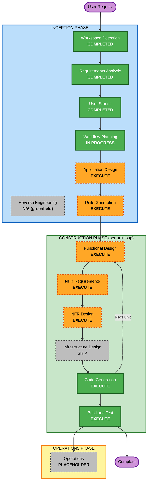

# Execution Plan — Dayswork

## 1. Detailed Analysis Summary

### Transformation Scope
- **Project Type**: Greenfield SMAPI mod (no existing code, no brownfield transformation analysis required)
- **Primary Deliverable**: A redistributable C# / .NET 6 assembly + asset pack targeting Stardew Valley 1.6 via SMAPI 4.x, published to Nexus under MIT
- **Surface area**: 20 user stories across 5 journey sections; 13 FR groups; 13 named technical components in the source spec

### Change Impact Assessment
| Impact area | Verdict |
|---|---|
| **User-facing changes** | Yes — entire mod is a new user-facing feature (bulletin-board entry, 4-screen UI, NPC, mail letters, GMCM config) |
| **Structural changes** | Yes — designing a multi-component mod from scratch; component boundaries matter for testability (NFR-MAINT-01) |
| **Data model changes** | Yes — new persisted shape: contracts, zones, chest assignments, recurring schedule state, capability snapshot, item buffer |
| **API changes** | N/A — no public API; SMAPI is the only consumer/integrator |
| **NFR impact** | Yes — performance (worker update loop), safety (no items/gold lost), maintainability (pure logic separation), localization (i18n routing) |

### Risk Assessment
- **Risk Level**: **Medium**
- **Why not Low**: real save files / real in-game gold / real items at stake; defective release reaches many Nexus users; user is new to C#/SMAPI (architectural mis-steps possible without explicit design)
- **Why not High**: single-player only (FR-MP-01), no network surface, no PII, no concurrent users; "no items/gold lost" invariant is enforceable via PBT
- **Rollback Complexity**: Easy — uninstalling the mod removes the entry point and leaks only inert save data (FR-PERSIST-02). Players can pin to a previous Nexus version.
- **Testing Complexity**: Moderate — pure logic gets full xUnit + FsCheck coverage; UI and NPC behaviors need manual play-testing against multiple farm types (NFR-COMPAT-01)

### Top three architectural risks to manage
1. **Coupling pure logic to game runtime** — would make NFR-MAINT-01/03 unsatisfiable and the PBT obligations in S-19 unimplementable. Mitigated by executing Application Design + NFR Design with explicit separation.
2. **Worker shift orchestration sprawling across event handlers** — leads to bugs in calendar edge cases (sleep fast-forward, festivals, stuck recovery). Mitigated by designing the shift orchestrator as an explicit state machine in Functional Design.
3. **Harmony patch conflicts** — Stardew's modding ecosystem has many Harmony users; sloppy patches break compat. Mitigated by isolating patches in a single namespace (NFR-MAINT-04) and documented in code-generation planning.

---

## 2. Workflow Visualization



### Text fallback (always shown alongside Mermaid)

```
INCEPTION
  Workspace Detection ........... COMPLETED
  Reverse Engineering ........... N/A (greenfield)
  Requirements Analysis ......... COMPLETED
  User Stories .................. COMPLETED
  Workflow Planning ............. IN PROGRESS (this document)
  Application Design ............ EXECUTE
  Units Generation .............. EXECUTE
       │
       ▼
CONSTRUCTION (loops per unit)
  Functional Design ............. EXECUTE
  NFR Requirements .............. EXECUTE
  NFR Design .................... EXECUTE
  Infrastructure Design ......... SKIP (no cloud/container/IaC)
  Code Generation ............... EXECUTE
       │
       ▼  (after all units complete)
  Build and Test ................ EXECUTE

OPERATIONS
  Operations .................... PLACEHOLDER (v1 ships without deployment automation)
```

---

## 3. Phases to Execute

### INCEPTION PHASE
- [x] **Workspace Detection** — COMPLETED 2026-05-18
- [x] **Reverse Engineering** — N/A (greenfield; no existing code)
- [x] **Requirements Analysis** — COMPLETED 2026-05-18
- [x] **User Stories** — COMPLETED 2026-05-18
- [x] **Workflow Planning** — IN PROGRESS (this document)
- [ ] **Application Design** — **EXECUTE**
  - **Rationale**: 13 distinct technical components in the source spec, 3 architectural risks called out above. Component identification, dependency mapping, and the pure-logic / SMAPI-integration boundary need to be designed before unit decomposition. NFR-MAINT-01 and S-19 are unsatisfiable without this stage.
- [ ] **Units Generation** — **EXECUTE**
  - **Rationale**: The system decomposes naturally into ~12–17 units (the source spec's "Suggested build order" already gestures at 12). Without explicit Units Generation, Code Generation would either be one giant monolithic plan or implicit/ad-hoc. Standard depth is sufficient — this is one developer, no parallel teams.

### CONSTRUCTION PHASE (per-unit loop)
- [ ] **Functional Design** — **EXECUTE** (per unit, where applicable)
  - **Rationale**: Several units carry non-trivial business logic (rate calc, task queue priority, capability evaluation, stuck escalation, deposit-run optimization). PBT-01 mandates property identification during Functional Design for any unit subject to the partial-PBT enforcement (rates, deposit/refund, zone math, save round-trips). Units with no business logic (e.g., the multiplayer guard) can mark FD as N/A inside the per-unit loop.
- [ ] **NFR Requirements** — **EXECUTE** (per unit)
  - **Rationale**: Some units have unit-specific performance budgets (worker update loop ≤ 1ms/frame; tile scan once-per-zone-entry rather than per-frame; UI overlay responsive on full-farm zones). Tech-stack confirmation (FsCheck per PBT-09) belongs here.
- [ ] **NFR Design** — **EXECUTE** (per unit, conditional on NFR Requirements producing items)
  - **Rationale**: NFR patterns need explicit design: pure-logic separation pattern, i18n routing pattern, Harmony patch isolation pattern, save-data versioning pattern. Cross-cutting NFR enforcement (PBT obligations) carries forward into Code Generation plans.
- [ ] **Infrastructure Design** — **SKIP**
  - **Rationale**: A SMAPI mod has no traditional infrastructure layer. There is no cloud, no container, no IaC, no networking, no scaling policy. The "platform" is the player's installed Stardew Valley + SMAPI runtime, which we do not provision. File-shaped artifacts (compiled DLL, `manifest.json`, `i18n/`, sprite assets, `config.json` schema) are part of the build output and belong in Code Generation, not Infrastructure Design.
- [ ] **Code Generation** — **EXECUTE** (per unit, always)
  - **Rationale**: Always required. Per-unit Planning + Generation parts per the rule. Each unit's generation will lean on the just-in-time onboarding decision (NFR-ONBOARD-01) to embed C#/SMAPI explanations where they first appear.
- [ ] **Build and Test** — **EXECUTE** (after all units complete)
  - **Rationale**: Always required. Build instructions for `dotnet build`; xUnit run instructions; FsCheck PBT instructions with seed logging (PBT-08); manual test plan for UI/NPC behaviors that aren't unit-testable. Compatibility test note across the 7 vanilla farm types (FR-COMPAT-02).

### OPERATIONS PHASE
- [ ] **Operations** — PLACEHOLDER
  - **Rationale**: v1 ships without deployment automation. The "deployment" of a SMAPI mod is a player downloading a `.zip` from Nexus and extracting it to `Stardew Valley/Mods/`. There is no operations workload to define in this AI-DLC iteration. Future operations work could include a release-automation GitHub Action (build → zip → draft GitHub release → upload to Nexus via their API) but that's explicitly post-v1.

---

## 4. Adaptive Depth

Per the always-execute rule, all defined artifacts will be created. Depth within each artifact adapts to unit complexity:
- **Standard depth** for most units (Hiring UI screens, GMCM config, Harmony patches)
- **Comprehensive depth** for the high-risk units flagged in §1: pure-logic core, shift orchestrator/state machine, save-data persistence
- **Minimal depth** for trivial units (multiplayer guard, i18n bootstrap)

The model determines actual depth per unit during Units Generation.

---

## 5. Estimated Timeline (advisory)

This is a solo, learn-as-you-go project; calendar estimates depend heavily on the user's available time. Rough effort sizing:

| Phase | Effort sizing |
|---|---|
| Remaining Inception (Application Design + Units Generation) | Small — one to two work sessions |
| Construction per-unit loop (12–17 units × Functional Design + NFR + Code Generation) | Largest phase by far — measured in days-to-weeks per unit grouping depending on Stardew/SMAPI learning curve |
| Build and Test | Medium — one to two work sessions for documented instructions; ongoing for actual play-testing across farm types |

**No deadline is imposed by the requirements.** Recurring contracts and the v1 scope are stable; the user can iterate at their own pace.

---

## 6. Success Criteria

### Primary goal
A functioning, MIT-licensed, single-player Stardew Valley 1.6 SMAPI mod, downloadable from Nexus, that satisfies every FR in `requirements.md §2` and respects every NFR in §3, with PBT-enforced safety on rates / deposits / refunds / save round-trips.

### Key deliverables (post-Construction)
1. `Dayswork` — SMAPI mod assembly (compiled DLL + `manifest.json` + assets + `i18n/default.json`)
2. `Dayswork.Tests` — xUnit + FsCheck test project with PBT coverage for pure-logic core
3. Build & test documentation (`aidlc-docs/construction/build-and-test/`)
4. Nexus-ready release artifact (`.zip` containing the mod folder structure)
5. README + LICENSE + brief Nexus description draft

### Quality gates
- **PBT compliance**: blocking rules (PBT-02 round-trip, PBT-03 invariant, PBT-07 generator quality, PBT-08 shrinking/seed logging, PBT-09 framework selection) all green for the pure-logic units
- **Safety invariants**: `no items lost` and `no gold lost beyond billed hours` are encoded as property tests
- **Manual play-test pass**: at minimum the Standard Farm walk-through of the v1 user journey (S-01 through S-13) on a fresh save and a mid-game save
- **Compat warning pass**: at minimum a smoke test on one non-Standard vanilla farm type
- **Code style**: `dotnet format` clean
- **Harmony patches**: located only in `Dayswork.Patches`; one patch per file; documented per spec §Technical architecture
