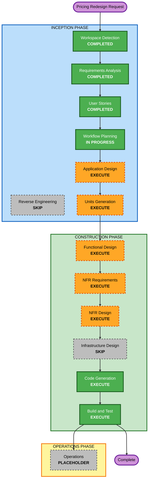

# Execution Plan — Pricing Model Redesign

## Workflow Planning Checklist
- [x] Load the current requirements, pricing-question answers, user stories, and personas for the redesign pass
- [x] Compare the redesign requirements against the existing application-design and unit-of-work artifacts
- [x] Assess impact across completed units, runtime behavior, persistence, UI, and test coverage
- [x] Determine which remaining AI-DLC stages should execute for this redesign
- [x] Generate the updated execution plan, workflow visualization, and brownfield retrofit sequence

---

## 1. Detailed Analysis Summary

### Transformation Scope
- **Transformation type**: Brownfield pricing-and-runtime redesign inside an already-built SMAPI mod
- **Primary change**: Replace the current hourly deposit/refund model with a fixed contract price plus visible worker-energy model, while keeping the mod balanced against vanilla Stardew
- **Why this is not a small patch**: the redesign changes contract creation, summary UI, recurring billing, daily scheduler behavior, worker shift termination rules, GMCM/config semantics, and the mental model the player uses to trust the system
- **Existing design status**: prior Inception and Construction artifacts are still useful, but the pricing-related parts are now materially outdated because they assume hourly estimates, deposits, refunds, and refund settlement flows

### Change Impact Assessment
| Impact area | Verdict |
|---|---|
| **User-facing changes** | Yes — pricing preview, confirmation flow, recurring expectations, greenhouse/animal scope language, worker stamina display, and pacing all change |
| **Structural changes** | Yes — pricing/accounting seams in `Dayswork.Core` must be redesigned, and existing UI/orchestration layers must stop depending on deposit/refund concepts |
| **Data model changes** | Yes — contract pricing fields, recurring charge semantics, and likely config snapshot fields change; saved contracts must remain intelligible across the transition |
| **API changes** | No public external API, but multiple internal component contracts will change |
| **NFR impact** | Yes — safety, clarity, performance, pacing, and PBT obligations are all affected |

### Component Relationships
- **Primary components**: Core pricing/accounting logic, contract scope classification, worker energy accounting, hiring summary UI, recurring scheduler, shift orchestrator
- **Shared components**: Contract DTOs, config snapshot/defaults, i18n keys, save-data serializers, test generators
- **Dependent components**: `SummaryMenu`, `TaskSelectionMenu`, `ScheduleMenu`, `HiringFlowCoordinator`, `RecurringContractScheduler`, `CalendarHandlers`, `ShiftOrchestrator`, `GMCMRegistrar`
- **Supporting components**: `MailDispatcher` for cannot-afford/festival messaging, worker HUD visuals, regression tests, build-and-test docs

### Existing Units Most Affected
| Unit / area | Change type | Reason | Priority |
|---|---|---|---|
| **U-05 Pricing Core** | Major | Deposit, refund, and hours-estimation assumptions are no longer the pricing model | Critical |
| **U-09 Minimum Hiring Flow** | Major | Screen 1 / Screen 4 pricing preview and confirmation behavior must move to fixed-price semantics | Critical |
| **U-10 Worker Shift Slice** | Major | Shift termination now depends on energy exhaustion and work-unit completion, not refundable time | Critical |
| **U-12 Hiring UI Schedule** | Minor to Major | Schedule text and edit semantics must reflect stable recurring contract pricing | Important |
| **U-15 Recurring Lifecycle + Calendar** | Major | Day-start charging, festival handling, rain/no-work behavior, and messaging all change | Critical |
| **U-16 Animals & Buildings** | Minor to Major | Animal-building scope and greenhouse package pricing need to align with the new contract model | Important |
| **U-17 GMCM + i18n Polish** | Major | Config surface changes from hourly/deposit knobs to price/energy/action-cost knobs | Critical |
| **Build/Test docs** | Major | Existing verification still references refunds, deposits, and settlement mail expectations | Critical |

### Risk Assessment
- **Risk Level**: **High**
- **Why High**: this touches live gold flow, recurring automation, already-completed units, player trust, and multiple edge-case handlers in a mature codebase
- **Rollback Complexity**: Moderate — code rollback is easy through git/versioning, but a bad release can confuse persisted recurring contracts and player expectations
- **Testing Complexity**: High — pure logic can be covered well with xUnit + FsCheck, but UI clarity, pacing, energy exhaustion, and recurring lifecycle still require manual play-testing

### Top Risks To Manage
1. **Leaving old deposit/refund assumptions alive in hidden seams**. The redesign fails if the UI says “fixed price” but runtime or saved contracts still secretly depend on hourly math.
2. **Breaking recurring lifecycle behavior while changing billing semantics**. Day-start charging, festivals, rain, and no-work days need a single coherent model.
3. **Creating an opaque energy system**. If pricing becomes simpler but energy/output feels arbitrary, the redesign still misses its UX goal.

---

## 2. Workflow Visualization



### Text Fallback

```text
INCEPTION
  Workspace Detection ........... COMPLETED
  Reverse Engineering ........... SKIP (existing design docs are sufficient for this targeted redesign)
  Requirements Analysis ......... COMPLETED
  User Stories .................. COMPLETED
  Workflow Planning ............. IN PROGRESS (this document)
  Application Design ............ EXECUTE
  Units Generation .............. EXECUTE
       |
       v
CONSTRUCTION
  Functional Design ............. EXECUTE
  NFR Requirements .............. EXECUTE
  NFR Design .................... EXECUTE
  Infrastructure Design ......... SKIP
  Code Generation ............... EXECUTE
  Build and Test ................ EXECUTE

OPERATIONS
  Operations .................... PLACEHOLDER
```

---

## 3. Phases to Execute

### INCEPTION PHASE
- [x] **Workspace Detection** — COMPLETED earlier; the workspace is already known and active
- [x] **Reverse Engineering** — SKIP for this pass
  - **Rationale**: existing requirements, application-design, units, and construction artifacts already document the system well enough for a targeted pricing retrofit
- [x] **Requirements Analysis** — COMPLETED for the pricing redesign
- [x] **User Stories** — COMPLETED for the pricing redesign
- [x] **Workflow Planning** — IN PROGRESS in this document
- [ ] **Application Design** — **EXECUTE**
  - **Rationale**: the current application-design artifacts still model hourly pricing, deposits, refunds, and hours estimation as first-class architectural seams. We need an application-design refresh that redefines the pricing/accounting core, contract-scope classification, worker-energy model, and UI/runtime integration points without losing the useful parts of the existing design.
- [ ] **Units Generation** — **EXECUTE**
  - **Rationale**: the existing unit map reflects the original greenfield build order, not a brownfield redesign across already-completed units. We need a retrofit-oriented unit breakdown that clusters the rework into coherent batches and makes the Construction loop manageable.

### CONSTRUCTION PHASE
- [ ] **Functional Design** — **EXECUTE**
  - **Rationale**: the pricing and energy rules are business logic heavy. We need explicit design for zone banding, animal/greenhouse scope pricing, per-action energy spending, zero-energy completion semantics, and daily charge rules.
- [ ] **NFR Requirements** — **EXECUTE**
  - **Rationale**: the redesign has meaningful NFR impact on clarity, safety, frame-time behavior, and balance. We also need to preserve the “vanilla-feeling but not free labor” pacing target.
- [ ] **NFR Design** — **EXECUTE**
  - **Rationale**: the final design needs explicit patterns for pure pricing/energy logic, migration-friendly config semantics, and regression-safe boundaries between Core and SMAPI runtime behavior.
- [ ] **Infrastructure Design** — **SKIP**
  - **Rationale**: no cloud, deployment, container, or IaC changes are involved. This remains a local SMAPI mod runtime concern only.
- [ ] **Code Generation** — **EXECUTE**
  - **Rationale**: the redesign is not just documentation; it will require real code, tests, config changes, and updated player-facing strings/docs.
- [ ] **Build and Test** — **EXECUTE**
  - **Rationale**: the existing build/test instructions must be refreshed to remove refund/deposit expectations and add energy/pacing/regression coverage.

### OPERATIONS PHASE
- [ ] **Operations** — PLACEHOLDER
  - **Rationale**: unchanged from the existing project; no separate operations workflow is needed for this redesign

---

## 4. Brownfield Retrofit Sequence

This is the recommended implementation sequence. The exact unit names and boundaries should be finalized in Units Generation.

### Recommended update approach
- **Approach**: Hybrid, sequential by dependency with targeted regression checkpoints
- **Critical path**: Core pricing/accounting model → hiring/summary UI → shift runtime energy behavior → recurring lifecycle/day-start charging → config/test/docs cleanup
- **Parallelization**: Low. The redesign changes shared concepts that cut across the same runtime surfaces, so sequencing is safer than parallel edits.

### Likely retrofit batches
1. **Core Contract Pricing + Scope Classification**
   - Replace deposit/refund/hour-estimate assumptions with fixed-price service pricing
   - Define outdoor zone banding, greenhouse package pricing, animal-building pricing, and contract-total calculation
   - Define worker energy capacity and per-action energy-cost modeling as pure logic
2. **Hiring Flow + Summary Preview Refresh**
   - Update task-selection and summary screens to show fixed pricing, per-service contributions, and worker energy explanation
   - Remove deposit/refund/hour terminology from player-facing flows
3. **Shift Runtime Energy + Pacing Rework**
   - Add visible worker energy bar semantics
   - Spend energy per work action, not movement
   - Enforce “finish current work unit, then deposit and leave at zero”
   - Slow movement/task tempo to match the new contract fantasy
4. **Recurring Lifecycle + Calendar Charging Rules**
   - Change daily charging to fixed recurring price
   - Preserve no-charge festival behavior and same-day explanation mail
   - Keep rain/no-work days price-stable where required
5. **Config, Tests, and Regression Documentation**
   - Replace obsolete config knobs with price/energy/action-cost knobs
   - Update FsCheck/xUnit surfaces and manual test flows
   - Refresh build-and-test instructions to the new model

---

## 5. Estimated Timeline

| Phase | Effort sizing |
|---|---|
| **Remaining Inception** | Small to medium — one or two focused sessions for Application Design refresh and retrofit unit planning |
| **Construction** | Medium to large — likely several redesign units touching both `Dayswork.Core` and `Dayswork` |
| **Build and Test** | Medium — pure-logic regression coverage plus manual play-testing for UI clarity, pacing, and recurring behavior |

There is no recommended shortcut here. The safest path is to spend a little extra time in design so the code rework removes the old billing model cleanly instead of layering on top of it.

---

## 6. Success Criteria

### Primary Goal
Ship a coherent pricing redesign in which players pay a clear fixed contract price, understand the worker’s energy-limited output, and no longer encounter the current deposit/refund complexity.

### Key Deliverables
1. Refreshed Application Design artifacts for the pricing/energy model
2. A retrofit-oriented Units Generation breakdown for the redesign
3. Updated code and tests in `Dayswork.Core`, `Dayswork`, and `Dayswork.Tests`
4. Updated config/i18n/docs that no longer advertise hourly deposit/refund behavior
5. Refreshed build-and-test instructions for the redesigned model

### Quality Gates
- The codebase no longer uses the old deposit/refund model as the user-facing pricing contract
- Pure pricing and energy accounting logic remains isolated enough for xUnit + FsCheck coverage
- Recurring/festival/rain/no-work-day behavior matches the approved requirements
- Worker runtime behavior visibly supports the new energy model and slower pacing
- Manual play-tests confirm the system feels balanced and legible relative to vanilla expectations

### Extension Compliance Snapshot
- **Security Baseline**: N/A — disabled in `aidlc-state.md` for this project, so it is not enforced for this stage
- **Property-Based Testing**: Compliant — this plan preserves pure-logic seams for pricing/energy work and explicitly carries PBT-backed regression coverage forward into Construction and Build/Test
