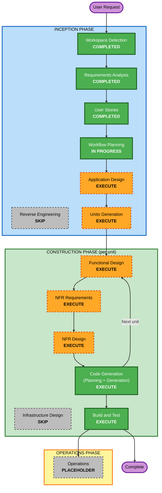

# Execution Plan — Manage Crops

**Source**: [manage-crops-requirements.md](../requirements/manage-crops-requirements.md) (FR-MC-01..44, NFR-MC-01..09),
stories S-27..S-35 in [stories.md](../user-stories/stories.md), spec [manage-crops-spec.md](../manage-crops-spec.md).

## Detailed Analysis Summary

### Transformation Scope (Brownfield)
- **Transformation Type**: Application change — a substantial new feature layered onto the existing SMAPI mod; no infrastructure/deployment-model change (SMAPI is the platform; deploy = build to Mods folder).
- **Primary Changes**: New managed-crop work-scope layer + authoring UI; autonomous viability-gated/self-healing crop shift behavior; autonomous town shopping with **new** cross-location store navigation + **headless** 1.6 shop transactions; second built-in office chest; per-zone output routing; save schema V2→V3 + migration/backfill; new energy action kinds + `WorkerTool.Hoe`; greenhouse/SVE-shed support.
- **Related Components** (existing types touched): `HubMenu`, `ZoneDrawOverlay`/`ZoneDrawMenu`/`IZoneDrawSource`, `ContractDraft`, `Contract`, `ContractScopeSelection`/`WorkScopeSet`, `HiringBuilding.BuildData()`, `ChestResolver`, `WorkerTool`/`ForTask`, `CapabilityEvaluator`/`CapabilityMatrix`, `WorkActionKind`/`WorkerEnergyProfile`, `TaskKind`, `ShiftOrchestrator`/`ShiftPlanBuilder`, `CrossLocationRouteNavigator`/`BuildingWorkNavigator`, persistence DTOs/`DaysworkSaveDataV2`/`ContractDtoV2`, `SveExpansionProfile`/`ExpansionProfileSelector`, GMCM/i18n.

### Change Impact Assessment
- **User-facing changes**: **Yes** — new hub page, crop-first authoring, draw-overlay coloring (DEV-MC-01), HUD notifications, two named cabin chests, GMCM toggles/energy costs.
- **Structural changes**: **Yes** — new work-scope layer (`ManagedCropWorkScope`) and crop-plan domain; new navigation legs to town stores; new shop-transaction seam.
- **Data model changes**: **Yes** — `CropPlan`/`CropZoneAssignment`/`SeasonCropChoice`/`StorePreference` + DTOs; save schema V2→V3; input-chest backfill.
- **API changes**: Internal only — new Core types/seams; no external/public API.
- **NFR impact**: **Yes** — determinism/PBT (full mode), shift-loop performance, item & gold safety, backward-compatible persistence, i18n/lint, vanilla/no-SVE invariance.

### Component Relationships
- **Primary Component**: `Dayswork.Core` (new crop-plan domain + pure planning logic + DTOs) and `Dayswork` (UI, runtime, navigation, shop, persistence wiring).
- **Shared Components**: capability/energy model, work-scope set, chest resolver, expansion profile seam.
- **Dependent Components**: `ShiftOrchestrator`/`ShiftPlanBuilder` (runtime execution), `HiringFlowCoordinator`/menus (authoring), `ChestResolver` (destinations).
- **Supporting Components**: GMCM config, i18n, FsCheck/xUnit test projects.

### Risk Assessment
- **Risk Level**: **High** — large surface, new town-store navigation + headless shop transaction (genuinely new capability), persistence schema bump + save migration/backfill, and live-game shop/data integration.
- **Rollback Complexity**: Moderate — feature is opt-in (absence = no managed crops); V2→V3 is additive with empty-plan default; risky areas (navigation/shop) are isolated behind seams.
- **Testing Complexity**: Complex — pure-logic PBT (full mode) + manual SMAPI playtests for authoring, planting/harvest, shopping trip, two-chest behavior, greenhouse/SVE-shed.

## Workflow Visualization

## Phases to Execute

### 🔵 INCEPTION PHASE
- [x] Workspace Detection (COMPLETED)
- [x] Reverse Engineering — **SKIP**
  - **Rationale**: Brownfield with current, sufficient artifacts; the spec is already grounded in current types. No refresh needed.
- [x] Requirements Analysis (COMPLETED)
- [x] User Stories (COMPLETED — S-27..S-35)
- [x] Workflow Planning (IN PROGRESS)
- [ ] Application Design — **EXECUTE**
  - **Rationale**: New components/seams need definition — `ManageCropsMenu`, the managed-crop work-scope layer, the crop-plan domain, the town-store navigation seam, the headless shop-transaction service, and the second cabin chest. Component methods, dependencies, and the vanilla/SVE seam boundaries must be designed before units.
- [ ] Units Generation — **EXECUTE**
  - **Rationale**: Large feature spanning Core + Mod + Tests; must be decomposed into sequential units of work (Q1=A).

### 🟢 CONSTRUCTION PHASE (per-unit loop)
- [ ] Functional Design — **EXECUTE** (per unit)
  - **Rationale**: New data models and complex business logic (viability, seed/fertilizer atomicity, multi-season locking, store/fallback, self-healing maintenance) need detailed design.
- [ ] NFR Requirements — **EXECUTE** (per unit)
  - **Rationale**: Determinism/PBT, performance envelope, item/gold safety, persistence compatibility, i18n, and vanilla invariance must be pinned per unit.
- [ ] NFR Design — **EXECUTE** (per unit)
  - **Rationale**: Pattern decisions (pure-Core seams, headless-shop adapter, navigation legs, migration/backfill barrier) follow from NFR requirements.
- [ ] Infrastructure Design — **SKIP**
  - **Rationale**: No cloud/container/IaC; SMAPI is the platform (consistent with all prior units).
- [ ] Code Generation — **EXECUTE (ALWAYS)** (per unit; Planning + Generation)
- [ ] Build and Test — **EXECUTE (ALWAYS)** (after all units)

### 🟡 OPERATIONS PHASE
- [ ] Operations — PLACEHOLDER (SMAPI mod; deploy = build to Mods folder, already automated)

## Proposed Unit Decomposition (finalized in Units Generation)
A foundation-first sequence; exact split confirmed during Units Generation:
1. **U-MC-01 — Crop-plan domain + persistence foundation**: Core types (`CropPlan`, `CropZoneAssignment`, `SeasonCropChoice`, `StorePreference`, `ManagedCropWorkScope`), DTOs, V2→V3 schema bump + empty-plan migration, pure planning logic skeleton + PBT round-trip. (S-34, S-35; FR-MC-37/38)
2. **U-MC-02 — Cabin chests**: second built-in `BuildingChest` (input), programmatic i18n names, `ChestResolver` exclusion of both, input-chest backfill for existing offices. (S-31, S-34; FR-MC-33..36, 39)
3. **U-MC-03 — Manage Crops authoring UI**: `HubMenu` button + `ManageCropsMenu`, crop-first authoring, crop list source (vanilla+modded, season filter, auto-buyable tagging), multi-season locking, `ContractDraft` crop plan. (S-27; FR-MC-01..05, 08)
4. **U-MC-04 — Zone draw overlay extension**: existing zones red/unselectable, active draw green, overlap prevention, delete-and-redraw (DEV-MC-01). (S-28; FR-MC-06/07)
5. **U-MC-05 — Shift crop behavior**: per-tile harvest-first ordering, till/fertilize/seed/water, viability gate, replant/gap-fill, re-till, debris/dead-plant toggles, `WorkerTool.Hoe` + capability gating, new energy kinds, coexistence. (S-29, S-33; FR-MC-09/10/11/21/22/24/25/26/27/28/30/31/32/40/42)
6. **U-MC-06 — Town shopping**: new cross-location store navigation legs, headless 1.6 shop transaction, paced per-transaction HUD notices, store/fallback resolution, festival skip, wallet funding, leftovers to input chest. (S-30; FR-MC-12..20, 41)
7. **U-MC-07 — Output routing + greenhouse/shed**: per-zone harvest routing, greenhouse/SVE-shed season-agnostic support (viability bypass, per-tile `Diggable`, reused routes). (S-31, S-32; FR-MC-23/29/43/44)

## Package Change Sequence (Brownfield)
1. **`Dayswork.Core`** — domain + DTOs + pure planning logic first (every unit's foundation).
2. **`Dayswork`** — runtime/UI/navigation/shop/persistence wiring second.
3. **`Dayswork.Tests`** — xUnit examples + FsCheck properties alongside each unit.

## Estimated Timeline
- **Total stages this change**: 2 remaining Inception (Application Design, Units Generation) + per-unit Construction (FD/NFR-Req/NFR-Design/Code Gen) across ~7 units + final Build and Test.
- **Estimated effort**: Large / multi-session (per-unit approval gates throughout).

## Success Criteria
- **Primary Goal**: Deliver the full Manage Crops feature per the spec, opt-in and non-regressive to existing contracts.
- **Key Deliverables**: Manage Crops page + authoring, viability-gated self-healing crop shift behavior, autonomous town shopping (headless), two cabin chests + per-zone routing, V3 persistence + migration/backfill, greenhouse/SVE-shed support, GMCM/i18n, full-mode PBT + manual playtests.
- **Quality Gates**: `dotnet build /p:EnableModDeploy=false` 0/0; `dotnet test` green; per-unit code-summaries; FsCheck properties passing; manual SMAPI playtest scenarios confirmed.
- **Integration Testing**: Authoring → shift → shopping → harvest → deposit end-to-end; vanilla and SVE-shed paths.
- **Operational Readiness**: Deploy = build to Mods folder (automated); no new infrastructure.
