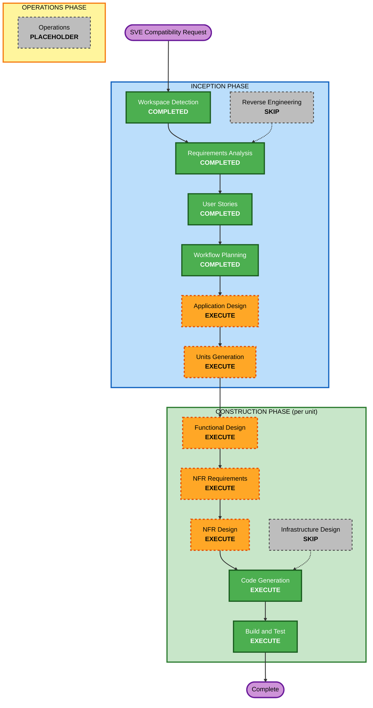

# Execution Plan — Stardew Valley Expanded (SVE) Compatibility

## Workflow Planning Checklist

- [x] Load SVE-compatibility requirements (FR-SVE-01..16, NFR-SVE-01..07) and verification answers.
- [x] Load generated SVE user stories (S-21..S-26) and persona confirmation.
- [x] Load existing application-design / construction context for worker, animal, building, and content components.
- [x] Assess scope, impact, risk, and affected modules.
- [x] Determine which remaining AI-DLC stages should execute or skip.
- [x] Validate Mermaid syntax by inspection and include a text alternative.
- [x] Generate this SVE-compatibility execution plan.

---

## Detailed Analysis Summary

### Transformation Scope

- **Transformation Type**: Brownfield architectural addition inside the existing SMAPI mod — a new, isolated expansion-compatibility seam plus targeted overrides, with vanilla behavior preserved.
- **Primary Changes**: A runtime-selected expansion-compatibility **provider** (Vanilla default + SVE), SVE detection, per-map worker-entrance resolution, data-driven animal-building feeding/capacity + premium-tier scope, content-classification overrides, and Grandpa's Shed as a work location.
- **Related Components**: `ShiftOrchestrator` (entrance), `AnimalTaskHandler` (capacity/auto-feed), `ObjectTargetClassifier` (clumps/trees), `AnimalBuildingTier` + hiring scope model, `BuildingWorkNavigator`/`BuildingLocationResolver`/`IndoorWorkScanner` (Grandpa's Shed), `ModEntry` (startup detection), and `Dayswork.Tests`.
- **Architectural Scope**: Introduces a **new component group** (the provider seam) — the reason Application Design executes for this change (unlike the worker-routing patch). The seam is the isolation boundary required by NFR-SVE-01/02.

### Change Impact Assessment

| Impact area | Verdict |
|---|---|
| **User-facing changes** | Yes — the farmhand works correctly on SVE farms, premium buildings, new content, and Grandpa's Shed; vanilla unchanged. |
| **Structural changes** | Yes — a new expansion-compatibility provider abstraction with a vanilla default and an SVE implementation (new component boundary + selection seam). |
| **Data model changes** | Minor — the hiring **scope model** must represent SVE premium animal-building tiers (today `AnimalBuildingTier` hardcodes six vanilla tiers). To be confirmed in Application/Functional Design whether this touches save DTOs. |
| **API changes** | Internal only — new provider interface + call-site delegation in orchestrator/handlers/classifier; no external contract. |
| **NFR impact** | Yes — isolation/vanilla-invariance, extensibility, determinism, performance (cached provider lookups), and full PBT obligations. |

### Component Relationships

| Component | Change type | Reason | Priority |
|---|---|---|---|
| **NEW** expansion-compat provider group (seam + Vanilla + SVE providers + selector) | Major | The isolation/extensibility boundary (FR-SVE-01/04, NFR-SVE-01/02). Pure, testable parts belong in `Dayswork.Core`; SMAPI-facing detection in `Dayswork`. | Critical |
| `ModEntry` | Minor | Select the active provider once at startup via the SMAPI mod registry; cache it (NFR-SVE-06). | Critical |
| `ShiftOrchestrator` | Minor/Major | Delegate farm-entrance/exit resolution to the provider (override only where the `Farm.warps` heuristic misfires). | Critical |
| `AnimalTaskHandler` | Minor/Major | Replace hardcoded `FeedCapacity` ladder + `"Deluxe"`-only auto-feed with data-driven (trough/occupant) derivation via the provider; no auto-petter/auto-grabber special-casing. | Critical |
| `AnimalBuildingTier` + hiring scope/UI building enumeration | Major | Represent and select SVE premium animal buildings, not only the six vanilla tiers. | Critical |
| `ObjectTargetClassifier` | Minor | Provider hook for custom resource clumps / special trees; unknown → graceful skip. | Important |
| `BuildingWorkNavigator` / `BuildingLocationResolver` / `IndoorWorkScanner` | Minor/Major | Treat Grandpa's Shed as a work location (entry tile, indoor scan, chest deposit), grounded in SVE map source. | Important |
| `Dayswork.Tests` | Major | xUnit examples + FsCheck properties for provider selection, entrance resolution, capacity derivation, and classification. | Critical |
| `aidlc-docs/construction/build-and-test` | Minor | Add SVE manual-playtest scenarios per supported map / premium building / Grandpa's Shed alongside automated checks. | Important |

### Module Update Strategy

- **Update Approach**: Sequential, foundation-first, then independent override units.
- **Critical Path**:
  1. Provider seam + SVE detection + Vanilla default (foundation; everything else depends on it).
  2. Worker-entrance resolution + supported SVE farm maps.
  3. Animal buildings (data-driven capacity/feeding + premium-tier scope).
  4. World content (classification overrides) + Grandpa's Shed work location.
- **Coordination Points**: `Dayswork` depends on `Dayswork.Core` domain/pure types; keep pure compat logic in `Dayswork.Core` so `Dayswork.Tests` need no SMAPI runtime. SVE identifiers centralized in the SVE provider (NFR-SVE-07).
- **Testing Checkpoints**: Per-unit pure tests first, then full `dotnet build` / `dotnet test`, then manual SVE playtest per map/building.

### Risk Assessment

- **Risk Level**: Medium–High.
- **Rollback Complexity**: Moderate. The provider is isolated and the vanilla path is unchanged, so disabling/removing the SVE provider reverts behavior.
- **Testing Complexity**: Moderate–High. Pure compat logic is unit/PBT-testable; SVE-asset-dependent behavior requires manual playtest with SVE installed (NFR-SVE-05) because automated tests cannot load SVE content.
- **Main Risks**:
  - Entrance heuristic misfires on an SVE map without a verified override → worker spawns wrong; mitigated by per-map override grounded in source + playtest.
  - Premium-building capacity/auto-feed assumptions wrong if not read from data/source → under/over-feeding; mitigated by data-driven derivation + source verification.
  - Scope-model change for premium tiers could touch save DTOs → handle carefully in design to preserve persistence compatibility.
  - Hidden vanilla regressions if the seam leaks into the vanilla path → enforced by NFR-SVE-01 invariance tests.

---

## Workflow Visualization

### Mermaid Diagram

### Text Alternative

1. INCEPTION complete: Workspace Detection, Requirements Analysis, User Stories, Workflow Planning.
2. INCEPTION still to run: **Application Design (EXECUTE)** then **Units Generation (EXECUTE)**. Reverse Engineering is skipped.
3. CONSTRUCTION (per unit) executes Functional Design, NFR Requirements, NFR Design, Code Generation, and Build and Test. Infrastructure Design is skipped.
4. OPERATIONS remains a placeholder.

---

## Phases to Execute

### INCEPTION PHASE

- [x] Workspace Detection — COMPLETED
  - **Rationale**: Existing Dayswork codebase and AI-DLC state detected (brownfield continuation).
- [x] Reverse Engineering — SKIP
  - **Rationale**: Existing application-design/construction context is sufficient; targeted source reads of Dayswork and SVE are done inline per NFR-SVE-03. No full architecture inventory refresh needed.
- [x] Requirements Analysis — COMPLETED
  - **Rationale**: FR-SVE-01..16 / NFR-SVE-01..07 approved.
- [x] User Stories — COMPLETED
  - **Rationale**: S-21..S-26 and persona review complete.
- [x] Workflow Planning — COMPLETED
  - **Rationale**: This plan defines the remaining execution path.
- [ ] Application Design — **EXECUTE**
  - **Rationale**: A genuinely new component group (the expansion-compatibility provider seam) with method contracts and dependencies must be designed. This is the isolation/extensibility boundary (NFR-SVE-01/02) and the thing other expansions plug into.
- [ ] Units Generation — **EXECUTE**
  - **Rationale**: The work decomposes into a foundation unit plus a few independent override surfaces (entrance/maps, animal buildings, content + Grandpa's Shed). Decomposition keeps each construction pass focused and testable. *(User may override to a single combined unit — see Step 9 control note.)*

### CONSTRUCTION PHASE (per unit)

- [ ] Functional Design — **EXECUTE** (per unit)
  - **Rationale**: Provider selection, entrance resolution, capacity derivation, classification overrides, and Grandpa's Shed work-location behavior need precise behavioral design.
- [ ] NFR Requirements — **EXECUTE** (per unit)
  - **Rationale**: Isolation, vanilla-invariance, determinism, performance (cached lookups), and full PBT obligations are material.
- [ ] NFR Design — **EXECUTE** (per unit)
  - **Rationale**: Translate NFRs into concrete patterns (provider selection seam, pure-Core testable logic, caching/bounding, centralized SVE identifiers).
- [ ] Infrastructure Design — **SKIP**
  - **Rationale**: No cloud, container, networking, or IaC. SMAPI is the platform (consistent with the whole project).
- [ ] Code Generation — **EXECUTE** (always, per unit)
  - **Rationale**: Implementation planning, code, and tests required.
- [ ] Build and Test — **EXECUTE** (always, after all units)
  - **Rationale**: Full build/test verification plus SVE manual-playtest scenarios.

### OPERATIONS PHASE

- [ ] Operations — PLACEHOLDER
  - **Rationale**: No deployment/operations workflow applies to this local SMAPI mod.

---

## Proposed Unit Decomposition (to be finalized in Units Generation)

This is a **sketch** for review; the Units Generation stage produces the authoritative decomposition and dependencies.

| Unit | Scope | Stories / FRs | Depends on |
|---|---|---|---|
| **U-SVE-01 — Expansion-compat provider foundation** | Provider interface, Vanilla default, SVE provider shell, startup detection + selection, vanilla-invariance | S-21, S-26; FR-SVE-01/02/03/04; NFR-SVE-01/02/03/05/06/07 | — (foundation) |
| **U-SVE-02 — SVE farm maps & worker entrance** | Per-map entrance resolution overrides for IF2R / Grandpa's Farm / Frontier Farm; unreachable-tile skip | S-22; FR-SVE-05/06/15 | U-SVE-01 |
| **U-SVE-03 — SVE animal buildings** | Data-driven feeding capacity + auto-feed handling; premium-tier representation in hiring scope | S-23; FR-SVE-07/08/09/10/11 | U-SVE-01 |
| **U-SVE-04 — SVE content & Grandpa's Shed** | Content-classification overrides (clumps/trees/animal types); Grandpa's Shed as a work location; graceful skip + item safety | S-24, S-25; FR-SVE-12/13/14/15/16; NFR-SVE-04 | U-SVE-01 |

---

## Estimated Timeline

- **Remaining INCEPTION stages**: Application Design, Units Generation (2).
- **CONSTRUCTION**: per-unit loop across the proposed ~4 units (Functional Design → NFR Requirements → NFR Design → Code Generation each), then a single Build and Test pass.
- **Estimated Duration**: Medium feature cycle; foundation unit first, then the three override units (which are largely independent and individually small-to-medium).

## Success Criteria

- With no expansion installed, behavior is byte-for-byte identical to today (vanilla-invariance tests pass).
- With SVE installed, the worker spawns/exits correctly on IF2R, Grandpa's Farm, and Frontier Farm.
- Premium Barn/Coop are fully serviced (all troughs fed; pet/collect scan-and-skip; premium tiers selectable in scope).
- New SVE crops/trees/animals/products work via data-driven paths; verified gaps handled; unknown content skipped safely with no item loss.
- Grandpa's Shed is a usable work location (tasks + chest deposit).
- Adding a new expansion requires only a new provider; vanilla/core call sites are untouched.
- Pure compat logic covered by xUnit + FsCheck; SVE-dependent behavior validated by manual playtest.
- `dotnet build Dayswork.sln /p:EnableModDeploy=false` and `dotnet test Dayswork.sln` pass.

## Extension Compliance

| Extension | Status | Workflow-planning compliance |
|---|---|---|
| Security Baseline | Disabled | N/A — no security surface for this compatibility change. |
| Property-Based Testing | Enabled, full | Compliant — Application Design, per-unit Functional/NFR design, Code Generation, and Build/Test will carry full PBT obligations where applicable (provider selection, entrance resolution, capacity derivation, classification). |
