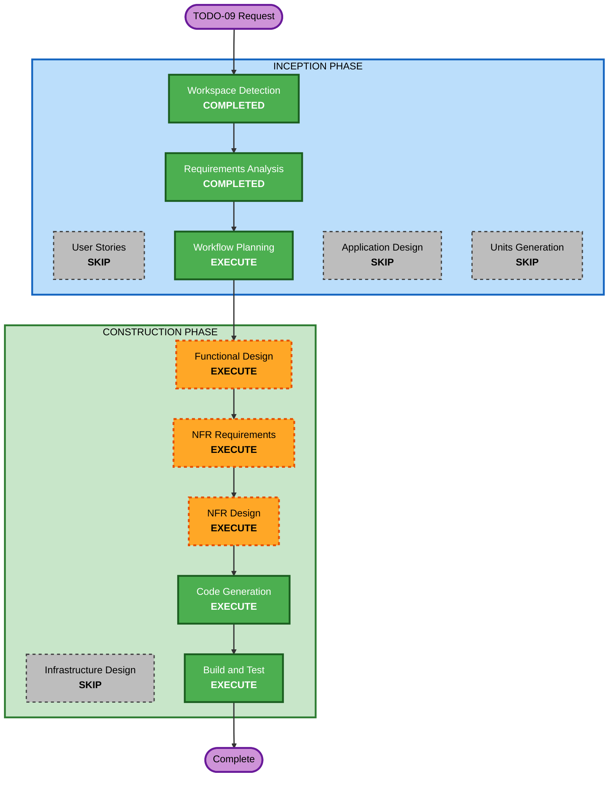

# Execution Plan — TODO-09 Per-Building Animal Work Ordering

## Detailed Analysis Summary

### Change Impact Assessment
- **User-facing changes**: Yes — the worker visits each animal building and does that building's indoor + grazing animal work together, instead of all indoors then one outdoor pass. Reduces cross-farm backtracking. No new UI/config.
- **Structural changes**: No new components — changes stay inside `ShiftPlanBuilder` (Core batch ordering) and `ShiftOrchestrator` (runtime batch handling). One new `BatchKind` value.
- **Data model changes**: No save-schema change. No new persisted contract data.
- **API changes**: No public API changes. Internal: one new enum value (`BatchKind.FarmForage`) and `BatchKind.OutdoorAnimals` semantics narrow to per-building.
- **NFR impact**: Determinism + testability (PBT full mode). No new whole-farm scans beyond today.

### Component Relationships
- **Primary**: `Dayswork.Core/Shifts/ShiftPlanBuilder.cs`, `Dayswork.Core/Shifts/WorkBatch.cs` (enum).
- **Dependent**: `Dayswork/Orchestration/ShiftOrchestrator.cs` (batch build/refresh/rescan), reuses `AnimalTaskHandler` (grazing→home attribution, unchanged).
- **Tests**: `Dayswork.Tests/Shifts/ShiftPlanBuilderTests.cs`, `Dayswork.Tests/U22/ScopeDrivenRuntimeAlignmentTests.cs`, plus new TODO-09 tests.

### Risk Assessment
- **Risk Level**: Low–Medium — contained to two files + tests; behavior is a re-ordering with an explicit "no dropped/duplicated work" invariant. Idempotent pet/collect makes the legacy-key edge safe.
- **Rollback Complexity**: Easy — revert two source files + tests; no migration.
- **Testing Complexity**: Moderate — example + FsCheck for ordering/contiguity invariants; manual in-game confirmation of routing.

## Workflow Visualization

## Phases to Execute

### INCEPTION PHASE
- [x] Workspace Detection (COMPLETED — brownfield resume)
- [x] Reverse Engineering (SKIPPED — existing project, no re-scan)
- [x] Requirements Analysis (COMPLETED — FR-T09-01..08, NFR-T09-01..04)
- [ ] User Stories — **SKIP**
  - **Rationale**: Pure scheduling refinement of existing worker behavior already covered by story S-23 (animal buildings). No new persona, feature, or acceptance surface.
- [x] Workflow Planning (IN PROGRESS)
- [ ] Application Design — **SKIP**
  - **Rationale**: No new components/services. Changes stay within existing `ShiftPlanBuilder`/`ShiftOrchestrator` boundaries; only one enum value is added.
- [ ] Units Generation — **SKIP**
  - **Rationale**: Single, small unit of work; no decomposition needed.

### CONSTRUCTION PHASE (single unit: `u-t09-animal-ordering`)
- [ ] Functional Design — **EXECUTE**
  - **Rationale**: Non-trivial batch-ordering logic and an explicit no-drop/no-duplicate invariant warrant a documented model + business rules.
- [ ] NFR Requirements — **EXECUTE**
  - **Rationale**: Determinism + PBT (full mode) quality bar must be captured.
- [ ] NFR Design — **EXECUTE** (light)
  - **Rationale**: Confirm pure-Core ordering seam + thin runtime adapter pattern; no new infrastructure.
- [ ] Infrastructure Design — **SKIP**
  - **Rationale**: SMAPI mod; no cloud/IaC.
- [ ] Code Generation — **EXECUTE (ALWAYS)**
- [ ] Build and Test — **EXECUTE (ALWAYS)**

### OPERATIONS PHASE
- [ ] Operations — PLACEHOLDER (SMAPI deploy = build-to-Mods, already automated)

## Success Criteria
- **Primary Goal**: Worker performs all of one animal building's animal work (indoor housed animals, then that building's grazing animals) before moving to the next building; farm-wide truffle forage is a single final pass.
- **Key Deliverables**: Updated `ShiftPlanBuilder` ordering, `ShiftOrchestrator` per-building grazing + farm-forage handling, new `BatchKind.FarmForage`, updated + new example/FsCheck tests.
- **Quality Gates**: `dotnet build` 0/0; `dotnet test` green; PBT invariants (each animal's work once; per-building animal work contiguous; farm-forage last; building order preserved); manual in-game routing confirmation.

## Estimated Timeline
- **Total stages remaining**: Functional Design → NFR Requirements → NFR Design → Code Generation → Build & Test (single unit).
