# Execution Plan - TODO-10 SVE Grandpa's Shed Greenhouse

## Detailed Analysis Summary

### Transformation Scope
- **Transformation type**: Brownfield application enhancement within the existing SVE compatibility and worker-navigation architecture.
- **Primary changes**: Add explicit SVE multi-hop route support for `Custom_GrandpasShedGreenhouse`, expose it as a single greenhouse-selection alternative, support shed greenhouse/main shed deposit destinations, and preserve route-failure/item-safety behavior.
- **Related components**:
  - `Dayswork.Core`: pure route model, route selection/validation decisions, and property-testable invariants.
  - `Dayswork`: SVE profile/compat adapter, greenhouse scope discovery, chest/deposit discovery, building/cross-location navigation, and shift orchestration.
  - `Dayswork.Tests`: route-model examples, FsCheck properties, scope-selection tests, and integration-style runtime tests.

### Change Impact Assessment
- **User-facing changes**: Yes. Players can intentionally select SVE's shed greenhouse as the greenhouse work area when available.
- **Structural changes**: Yes, moderate. Existing expansion compatibility needs a route-provider/navigation extension, but no broad architecture replacement.
- **Data model changes**: No save-schema change expected. The existing single `GreenhouseSelection(LocationName)` model remains authoritative.
- **API changes**: Internal only. New or expanded internal route-provider/navigation contracts are expected.
- **NFR impact**: Yes. Reliability, bounded lookup performance, testability, PBT coverage, manual SVE playtest, vanilla invariance, and item safety are explicit requirements.

### Component Relationships
- **Primary component**: `Dayswork` runtime orchestration/navigation.
- **Pure shared component**: `Dayswork.Core` route model and deterministic route decisions.
- **Supporting component**: `Dayswork.Tests` automated example/property/regression coverage.
- **Infrastructure components**: None.
- **Dependent components**: Existing greenhouse scope selection, `ShiftOrchestrator`, chest/deposit planning, `ExpansionCompatService`, and `SveExpansionProfile`.

### Risk Assessment
- **Risk level**: Medium-High.
- **Rollback complexity**: Moderate. Changes are localized but touch live routing, deposit safety, and SVE-only behavior.
- **Testing complexity**: Complex. Pure route invariants can be automated, but final route correctness depends on live SVE maps and requires manual SMAPI playtest.

## Workflow Visualization

### Mermaid Diagram

```mermaid
flowchart TD
    Start(["User Request"])

    subgraph INCEPTION["INCEPTION PHASE"]
        WD["Workspace Detection<br/><b>COMPLETED</b>"]
        RE["Reverse Engineering<br/><b>SKIP</b>"]
        RA["Requirements Analysis<br/><b>COMPLETED</b>"]
        US["User Stories<br/><b>COMPLETED</b>"]
        WP["Workflow Planning<br/><b>COMPLETED</b>"]
        AD["Application Design<br/><b>EXECUTE</b>"]
        UG["Units Generation<br/><b>SKIP</b>"]
    end

    subgraph CONSTRUCTION["CONSTRUCTION PHASE"]
        FD["Functional Design<br/><b>EXECUTE</b>"]
        NFRA["NFR Requirements<br/><b>EXECUTE</b>"]
        NFRD["NFR Design<br/><b>EXECUTE</b>"]
        ID["Infrastructure Design<br/><b>SKIP</b>"]
        CG["Code Generation<br/><b>EXECUTE</b>"]
        BT["Build and Test<br/><b>EXECUTE</b>"]
    end

    subgraph OPERATIONS["OPERATIONS PHASE"]
        OPS["Operations<br/><b>PLACEHOLDER</b>"]
    end

    Start --> WD
    WD --> RE
    RE --> RA
    RA --> US
    US --> WP
    WP --> AD
    AD --> UG
    UG --> FD
    FD --> NFRA
    NFRA --> NFRD
    NFRD --> ID
    ID --> CG
    CG --> BT
    BT --> OPS
    OPS --> End(["Complete"])

    style WD fill:#4CAF50,stroke:#1B5E20,stroke-width:3px,color:#fff
    style RA fill:#4CAF50,stroke:#1B5E20,stroke-width:3px,color:#fff
    style US fill:#4CAF50,stroke:#1B5E20,stroke-width:3px,color:#fff
    style WP fill:#4CAF50,stroke:#1B5E20,stroke-width:3px,color:#fff
    style AD fill:#FFA726,stroke:#E65100,stroke-width:3px,stroke-dasharray: 5 5,color:#000
    style FD fill:#FFA726,stroke:#E65100,stroke-width:3px,stroke-dasharray: 5 5,color:#000
    style NFRA fill:#FFA726,stroke:#E65100,stroke-width:3px,stroke-dasharray: 5 5,color:#000
    style NFRD fill:#FFA726,stroke:#E65100,stroke-width:3px,stroke-dasharray: 5 5,color:#000
    style CG fill:#FFA726,stroke:#E65100,stroke-width:3px,stroke-dasharray: 5 5,color:#000
    style BT fill:#FFA726,stroke:#E65100,stroke-width:3px,stroke-dasharray: 5 5,color:#000
    style RE fill:#BDBDBD,stroke:#424242,stroke-width:2px,stroke-dasharray: 5 5,color:#000
    style UG fill:#BDBDBD,stroke:#424242,stroke-width:2px,stroke-dasharray: 5 5,color:#000
    style ID fill:#BDBDBD,stroke:#424242,stroke-width:2px,stroke-dasharray: 5 5,color:#000
    style OPS fill:#FFF59D,stroke:#F57F17,stroke-width:2px,color:#000
    style Start fill:#CE93D8,stroke:#6A1B9A,stroke-width:3px,color:#000
    style End fill:#CE93D8,stroke:#6A1B9A,stroke-width:3px,color:#000

    linkStyle default stroke:#333,stroke-width:2px
```

### Text Alternative

Phase 1: INCEPTION
- Workspace Detection: COMPLETED
- Reverse Engineering: SKIP
- Requirements Analysis: COMPLETED
- User Stories: COMPLETED
- Workflow Planning: COMPLETED
- Application Design: EXECUTE
- Units Generation: SKIP

Phase 2: CONSTRUCTION
- Functional Design: EXECUTE
- NFR Requirements: EXECUTE
- NFR Design: EXECUTE
- Infrastructure Design: SKIP
- Code Generation: EXECUTE
- Build and Test: EXECUTE

Phase 3: OPERATIONS
- Operations: PLACEHOLDER

## Phases to Execute

### INCEPTION PHASE
- [x] Workspace Detection - COMPLETED
- [x] Reverse Engineering - SKIP
  - **Rationale**: Existing targeted SVE/routing artifacts and current source context are sufficient; a full brownfield reverse-engineering refresh would add noise for this focused TODO.
- [x] Requirements Analysis - COMPLETED
- [x] User Stories - COMPLETED
- [x] Workflow Planning - COMPLETED
- [ ] Application Design - EXECUTE
  - **Rationale**: TODO-10 introduces or extends internal route-provider/navigation components and needs component-method boundaries before detailed construction.
- [ ] Units Generation - SKIP
  - **Rationale**: This is one coherent unit of work across Core, Mod, and Tests; decomposition into multiple units would add coordination overhead without reducing risk.

### CONSTRUCTION PHASE
- [ ] Functional Design - EXECUTE
  - **Rationale**: Multi-hop route behavior, route availability, deposit routing, skip/continue semantics, and greenhouse-only task boundaries need explicit business rules.
- [ ] NFR Requirements - EXECUTE
  - **Rationale**: Reliability, bounded performance, testability, PBT partial mode, vanilla invariance, and item safety are first-class constraints.
- [ ] NFR Design - EXECUTE
  - **Rationale**: The NFRs need concrete patterns for route validation, failure handling, caching/bounded lookup, and test seams.
- [ ] Infrastructure Design - SKIP
  - **Rationale**: No cloud, deployment architecture, networking, persistence service, or infrastructure-as-code changes are involved.
- [ ] Code Generation - EXECUTE
  - **Rationale**: Implementation planning, code changes, tests, and documentation summaries are required.
- [ ] Build and Test - EXECUTE
  - **Rationale**: Automated build/test plus manual SVE playtest are required before closing TODO-10.

### OPERATIONS PHASE
- [ ] Operations - PLACEHOLDER
  - **Rationale**: Operations is not expanded for this SMAPI mod workflow; deploy remains the existing build-to-Mods process.

## Package Change Sequence

1. **Dayswork.Core** - Define pure route model/selection/validation result types and deterministic decisions first, so property tests can anchor behavior.
2. **Dayswork** - Wire SVE route data, greenhouse discovery, cross-location navigation, route failure handling, and deposit routing into the runtime shell.
3. **Dayswork.Tests** - Add pure examples/FsCheck properties first where possible, then integration-style tests for greenhouse selection, route failure, vanilla no-op behavior, and item-safe deposit paths.
4. **aidlc-docs** - Record code-summary and build/test artifacts during Construction.

## Estimated Timeline
- **Total remaining executed stages after approval**: 6.
- **Expected duration**: Moderate. One focused design pass, one focused implementation pass, automated verification, and at least one manual SVE playtest.

## Success Criteria
- **Primary goal**: Dayswork can service `Custom_GrandpasShedGreenhouse` as an explicitly selected greenhouse work location on supported SVE farm maps without changing vanilla or standard greenhouse behavior.
- **Key deliverables**:
  - Application design for the route-provider/navigation extension.
  - Functional/NFR design artifacts for route and deposit semantics.
  - Code and tests for route data, validation, greenhouse selection, navigation, deposit safety, and failure behavior.
  - Build/test summary with automated results and manual SVE playtest instructions/results.
- **Quality gates**:
  - No save-schema change unless design finds an unavoidable reason and approval is requested first.
  - SVE-specific identifiers remain centralized behind the expansion compatibility seam or route provider.
  - Route validation is total and non-throwing.
  - Route failure skips the shed-greenhouse batch and continues remaining work without item loss.
  - Existing vanilla and standard SVE greenhouse behavior remains unchanged.
  - `dotnet build Dayswork.sln /p:EnableModDeploy=false` passes.
  - `dotnet test Dayswork.sln /p:EnableModDeploy=false` passes.
  - At least one live SVE playtest confirms shed-greenhouse work/deposit/exit behavior.

## Extension Rule Compliance

| Extension | Status | Compliance / Rationale |
|---|---|---|
| Security Baseline | Disabled | Skipped per TODO-10 configuration. No network, auth, secrets, or PII surface is introduced by the workflow plan. |
| Property-Based Testing | Enabled - Partial | Applicable. Plan executes NFR Requirements, NFR Design, Code Generation, and Build/Test so PBT-02, PBT-03, PBT-07, PBT-08, and PBT-09 can be enforced where route-model properties apply. |

## Content Validation
- Mermaid diagram validated manually before file creation:
  - Node IDs are alphanumeric.
  - Diagram uses `flowchart TD` with valid node declarations and connections.
  - Labels avoid unescaped quotes.
  - A text alternative is provided.
- No ASCII diagrams.
- Markdown tables/lists use standard syntax.
