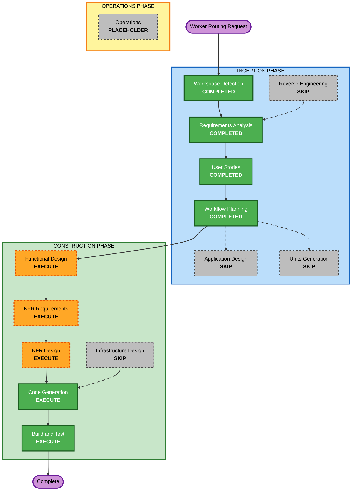

# Execution Plan — Worker Routing and Dynamic Task Selection

## Workflow Planning Checklist

- [x] Load worker-routing requirements and verification answers.
- [x] Load generated worker-routing story updates and persona confirmation.
- [x] Load existing application-design context for worker orchestration components.
- [x] Assess scope, impact, risk, and affected modules.
- [x] Determine which remaining AI-DLC stages should execute or skip.
- [x] Validate Mermaid syntax by inspection and include a text alternative.
- [x] Generate this worker-routing execution plan.

---

## Detailed Analysis Summary

### Transformation Scope

- **Transformation Type**: Brownfield targeted runtime behavior fix inside the existing SMAPI mod.
- **Primary Changes**: Worker route selection, approach-tile choice, active-batch task ordering, animal/product locality, and temporary blocked-task retry behavior.
- **Related Components**: `WorkAreaScanner`, `AnimalTaskHandler`, `WorkerMovementDriver`, `ShiftOrchestrator`, `ShiftContext`, `TaskPriorityOrderer`, and routing-focused tests.
- **Architectural Scope**: Existing worker orchestration architecture remains intact. Any helper extraction should stay within existing runtime/core component boundaries.

### Change Impact Assessment

| Impact area | Verdict |
|---|---|
| **User-facing changes** | Yes — the farmhand visibly chooses more sensible nearby work and avoids false task abandonment. |
| **Structural changes** | Minor — likely helper methods/classes for route-cost selection and deferral; no new top-level service layer. |
| **Data model changes** | No — no save schema or contract shape changes expected. |
| **API changes** | Internal only — possible method signatures for scanner/navigation helpers. |
| **NFR impact** | Yes — route checks must stay performant and deterministic; full PBT is now enabled where applicable. |

### Component Relationships

| Component | Change type | Reason | Priority |
|---|---|---|---|
| `WorkAreaScanner` | Minor/Major | Approach-tile selection and tile-work ordering must use shortest reachable route rather than fixed direction or task-tile distance. | Critical |
| `AnimalTaskHandler` | Minor | Animal navigation tile choice may need route-aware candidates instead of first passable neighbor. | Critical |
| `ShiftOrchestrator` | Major | Active-batch selection, animal-vs-tile interleaving, deferral, and retry behavior live here today. | Critical |
| `WorkerMovementDriver` | Minor | Existing passability/path behavior should be reused or exposed safely for route-cost evaluation. | Important |
| `Dayswork.Tests` | Major | Needs example tests for reported regressions plus FsCheck properties for route ordering and retry termination. | Critical |
| `aidlc-docs/construction/build-and-test` | Minor | Build/test instructions should include routing-specific regression and PBT checks. | Important |

### Module Update Strategy

- **Update Approach**: Sequential, single unit.
- **Critical Path**:
  1. Define route selection and deferral behavior.
  2. Add or expose testable route/deferral helpers.
  3. Integrate helpers into scanner/animal/orchestrator runtime.
  4. Add example and property-based tests.
  5. Run build and tests.
- **Coordination Points**: `Dayswork` depends on existing `Dayswork.Core` domain types and `Dayswork.Tests` should avoid requiring SMAPI runtime where possible.
- **Testing Checkpoints**: Focused route/deferral tests first, then full `dotnet build` and `dotnet test`.

### Risk Assessment

- **Risk Level**: Medium.
- **Rollback Complexity**: Moderate. The change is localized, but runtime task ordering can create subtle gameplay regressions.
- **Testing Complexity**: Moderate. Some pathing behavior depends on Stardew runtime objects, so pure helper seams are important for reliable automated tests.
- **Main Risks**:
  - Route-cost checks become too expensive if performed too often.
  - Deferral retry loops can cycle forever without strict progress/attempt guards.
  - Animal work and product tile work can be ordered incorrectly if queues remain separated.
  - Feeding could accidentally collect unpaid products, which is explicitly out of scope.

---

## Workflow Visualization

### Mermaid Diagram

### Text Alternative

1. INCEPTION: Workspace Detection, Requirements Analysis, User Stories, and Workflow Planning are complete.
2. INCEPTION skipped stages: Reverse Engineering refresh, Application Design, and Units Generation.
3. CONSTRUCTION executes Functional Design, NFR Requirements, NFR Design, Code Generation, and Build and Test.
4. CONSTRUCTION skips Infrastructure Design.
5. OPERATIONS remains a placeholder.

---

## Phases to Execute

### INCEPTION PHASE

- [x] Workspace Detection — COMPLETED
  - **Rationale**: Existing Dayswork codebase and AI-DLC state detected.
- [x] Reverse Engineering — SKIP
  - **Rationale**: This targeted change uses existing application-design and construction context; no architecture inventory refresh is needed.
- [x] Requirements Analysis — COMPLETED
  - **Rationale**: Worker-routing requirements are approved.
- [x] User Stories — COMPLETED
  - **Rationale**: S-08, S-16, S-19, and persona confirmation are updated.
- [x] Workflow Planning — COMPLETED
  - **Rationale**: This plan defines the remaining execution path.
- [ ] Application Design — SKIP
  - **Rationale**: No new top-level component, service, UI flow, data model, or persistence boundary is required.
- [ ] Units Generation — SKIP
  - **Rationale**: The work is a single targeted unit, not a multi-unit decomposition.

### CONSTRUCTION PHASE

- [ ] Functional Design — EXECUTE
  - **Rationale**: Shortest-route selection, active-batch nearest-task choice, feed deferral, and retry termination need precise behavioral design.
- [ ] NFR Requirements — EXECUTE
  - **Rationale**: Performance, determinism, and full PBT obligations are material for this change.
- [ ] NFR Design — EXECUTE
  - **Rationale**: NFR requirements should be translated into concrete route-cost, caching/bounding, and testability patterns.
- [ ] Infrastructure Design — SKIP
  - **Rationale**: No cloud, deployment, networking, or infrastructure resources are involved.
- [ ] Code Generation — EXECUTE
  - **Rationale**: Implementation planning, code changes, and tests are required.
- [ ] Build and Test — EXECUTE
  - **Rationale**: Full build/test verification plus routing regression instructions are required.

### OPERATIONS PHASE

- [ ] Operations — PLACEHOLDER
  - **Rationale**: No deployment/operations workflow applies to this local SMAPI mod fix.

---

## Single Unit Definition

### U-WR — Worker Routing and Dynamic Task Selection

- **Purpose**: Make the farmhand choose shortest reachable approach tiles, select nearest reachable work inside the active broad batch, and defer/retry temporarily blocked work without collecting unpaid products.
- **Primary Files Expected**:
  - `Dayswork/Orchestration/WorkAreaScanner.cs`
  - `Dayswork/Orchestration/AnimalTaskHandler.cs`
  - `Dayswork/Orchestration/ShiftOrchestrator.cs`
  - `Dayswork/Worker/WorkerMovementDriver.cs`
  - `Dayswork.Core/Shifts/*` if pure helper seams are introduced
  - `Dayswork.Tests/*` focused example and property tests
- **Documentation Outputs Expected**:
  - Functional Design artifacts under `aidlc-docs/construction/u-wr-worker-routing-dynamic-task-selection/functional-design/`
  - NFR artifacts under `aidlc-docs/construction/u-wr-worker-routing-dynamic-task-selection/nfr-requirements/` and `nfr-design/`
  - Code summary under `aidlc-docs/construction/u-wr-worker-routing-dynamic-task-selection/code/`

---

## Estimated Timeline

- **Total remaining stages**: 5 execute stages plus 2 skipped stage confirmations.
- **Estimated Duration**: Small-to-medium patch cycle; likely one focused implementation pass after design gates.

## Success Criteria

- Worker chooses the shortest reachable stand tile for adjacent-interaction work.
- Worker chooses nearest reachable task inside the active broad batch.
- Animal work no longer sends the worker past closer eligible animals inside the active batch.
- Egg/product tasks are not abandoned when any valid side is reachable.
- Feed work defers and retries after enabled work may clear blockers.
- Product collection is never performed when `CollectAnimalProducts` is disabled.
- Deferral cannot loop forever.
- Example tests cover the reported regressions.
- FsCheck properties cover route-ordering and retry termination invariants.
- `dotnet build Dayswork.sln /p:EnableModDeploy=false` passes.
- `dotnet test Dayswork.sln` passes.

## Extension Compliance

| Extension | Status | Workflow-planning compliance |
|---|---|---|
| Security Baseline | Disabled | N/A - no security enforcement for this game mod change. |
| Property-Based Testing | Enabled, full | Compliant - Functional Design, NFR, Code Generation, and Build/Test are planned to carry full PBT obligations where applicable. |
